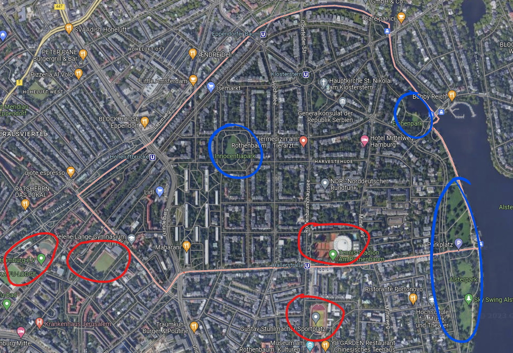

# Harvestehude

# Inhalt

# Aufgabenstellung

[Aufgabe](Harvestehude/Aufgabe.md)

# Leitfrage

Welche Merkmale und Faktoren können dazu beitragen, dass Harvestehude im Vergleich zu anderen Stadtteilen sozial vorteilhaft ist?

# Hypothese

Aufgrund seiner hohen Immobilienpreise, seines hohen Bildungsniveaus, seiner Nähe zur Innenstadt und seiner hohen Lebensqualität könnte Harvestehude im Vergleich zu anderen Stadtteilen eine soziale Vorteilhaftigkeit aufweisen.

# Allgemeines

## Karte

Freizeitangebote (Rot) und Parks (Blau)

## Lokalisierung

- Koordinaten: 53° 34′ 39.54″ N, 9° 59′ 20.15″ E
- Bezirk: Eimsbüttel
    - süd-osten
- nordwestlich der Außenalster
- auf Geestrücken
- angrenzend an
    - Rotherbaum
    - Hoheluft ost
    - Hoheluft west
    - Eimsbüttel

### Besondere Orte

- Innocentia Park
- Grindelhochhäuser
- NDR Hauptsitz

# Untersuchungsaspekte

## Bildung

### Kess-Index
Bei dem Kess-Index handelt es sich um den Sozialindex für Hamburger Schulen 

#### Was ist der Kess-Index?

#### Wie wird der Index berechnet?

#### Veränderung zwischen 2013 und 2021
- Gegenüber dem letzten Erhebungsstand von 2013 ergab sich für 137 der insgesamt 311 staatlichen Schulen eine Veränderung.
- Bei den Grundschulen verbesserten sich 44 der Schulen und bei 39 nahm der Index ab.
- Bei den Stadtteilschulen nahmen 12 zu und 12 ab.
- Bei den Gymnasien stieg der Sozialindex bei 6 von 62 Schulen und 22 nahmen ab.

### Schulen und Universitäten in Harvestehude

### Abschlussquote

### Abischnitt

### Bewertungen

## Lebensqualität / Lebensorientierung

- Infrastruktur mit öffentlichen Verkehrsmitteln
- Einkaufsmöglichkeiten
- Restaurants
- kulturelle Angebote
- Erreichbarkeit von Arbeitsplätzen
    
    ](Harvestehude/Untitled%203.png)
    
    Parks in Harvestehude
    Quelle: [https://geoportal-hamburg.de/bildungsatlas/#](https://geoportal-hamburg.de/bildungsatlas/#)
    

## Nähe Zur Innenstadt

- Bus Haltestelle
    - Sophienterrasse
        - 19 (ca. 23 min bis hbf)
    - Oberstraße
        - 114 (ca. 10 min bis dammtor)
    - Alsterchaussee
        - 19 (ca. 21 min bis  hbf)
        - 15 mit 1 umstieg (ca. 22 min bis hbf)
    - Klosterstern
        - 114 (ca. 16 min bis  dammtor)
- U-Bahn Haltestellen
    - Klosterstern
        - U1 (ca. 15 min bis hbf)
    - Eppendorfer Baum
        - U3 (ca. 20 min bis hbf)
- Auto
    - meist zwischen 15 bis 20 min → abhängig von Verkehr

## Politisch-moralisches Denken

](Harvestehude/Untitled%205.png)

Wahlgewinner der einzelnen Stadtteile der Bundestagswahl 2021

Legende: Grün - GRÜNE, Rot - SPD, Grau - CDU
Quelle: [https://www.statistik-nord.de/wahlen/wahlen-in-hamburg/interaktive-karten-zu-den-wahlen-und-abstimmungen-in-hamburg](https://www.statistik-nord.de/wahlen/wahlen-in-hamburg/interaktive-karten-zu-den-wahlen-und-abstimmungen-in-hamburg)

Wahlbeteiligung: Harvestehude: 87,7 %

.svg)

## Einkommen

### Grundstückspreise

Die Grundstückspreise sind im Vergleich zum Durchschnitt 500% höher. Ein m² kostet 6200€.

Allgemein sind die Preise für Wohnungsflächen, seien es Grundstücke, Eigentumswohnungen oder Ein-familien-häuser, sehr viel teurer als in anderen Stadtteilen. 

Eigentumswohnungen ausgenommen, gibt es kein Stadtteil mit teureren Wohnungen. Nur in der Hafencity sind Eigentumswohnungen nochmals 20% teurer.

## Historie / Entwicklung / Gründe Der Strukturen

# Quellen

## Tabelle

[https://docs.google.com/spreadsheets/d/1xUDLfjz4zMoE-9t746hVxotkrj2IY5YRItVjVFxl_rg/edit?usp=drivesdk](https://docs.google.com/spreadsheets/d/1xUDLfjz4zMoE-9t746hVxotkrj2IY5YRItVjVFxl_rg/edit?usp=drivesdk)

[https://www.bundestagswahl-hh.de/ergebnisse_der_bundestagswahl_2021_stadtteil_203003.html](https://www.bundestagswahl-hh.de/ergebnisse_der_bundestagswahl_2021_stadtteil_203003.html)
