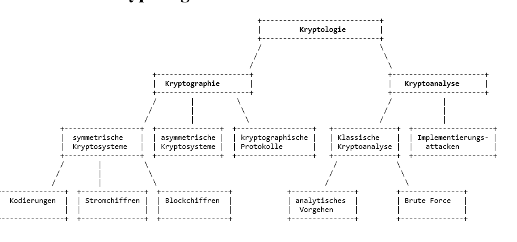

# Netzwerk

## Webserver einrichten

- Server installieren und starten
- Bei Vermittlungsrechner:
    - IP-Adresse im Server-Konfiguration erstellen (192.168.x.1)
    - IP-Adresse in der Switch-Konfiguration erstellen (192.168.x.1)
- Bei Server:
    - Gateway auf die IP-Adresse stellen, die man im Servertab erstellt hat.
- Bei PC:
    - Gateway auf die IP-Adresse stellen, die man im Switchtab erstellt hat.

Switch-Konfiguration beim Vermittlungsrechner:

Server-Konfiguration beim Vermittlungsrechner:

## ************************************DNS-Server einrichten************************************

- Switch erstellen und an alle anderen Switches mit User-PCs anschließen
- Bei dem erstellten Switch den DNS-Server anschließen
- DNS-Server installieren
- DNS-Server einrichten:
    - Domain aussuchen
    - IP auf die des jeweiligen Webservers stellen
- User-PCs → Domain Name Server auf die IP vom DNS-Server stellen

## Binärcode

11110100 ← 244

11110000 ← 240

255.255.255.240 - 255.255.255.255

11111111.11111111.11111111.11110000

255.255.255.248

11111111.11111111.11111111.11111011

Wenn man 4 PCs hat, 1 Router, + Broadcast und Netzadresse, dann ergibt das 7 IPs. Die nächste 2er Potenz ist 2³. Das heißt, dass man 256-2³ rechnet, was 248 ergibt. Somit ist die Netzmaske 255.255.255.248

Berechnen der Netzadresse:

IP-Adresse: 192.168.0.1

Sub.: 255.255.255.0

00000001 ← Hostadresse der IP-Adresse

& 00000000 ← 4. Oktett Subnetzmaske

00000000

Netzadresse: 192.168.0.0

IP-Adresse: 11000000.10101000.00000000.00000000

Sub.: 11111111.11111111.11111111.00000000

**Aufgabe 3.**

Recherchieren und finden Sie heraus, was mit „Man in the middle“ Angriff gemeint

ist und wie dieser durchgeführt wird.

Stellen Sie die wichtigsten Angriffspunkte dieser Attacke dar.

DHCP-Dienst (Dynamic Host Configuration Protocol), der für die Zuweisung lokaler IP-Adressen zuständig ist, sowie das ARP-System (Address Resolution Protocol), das Hardware-Adressen (Media Access Control, MAC) festlegt. Man-in-the-middle-Angriffe können auf globaler Ebene durchgeführt werden, indem DNS-Server manipuliert werden, die für die Auflösung von Internetadressen in öffentliche IPs zuständig sind. Hacker nutzen auch Sicherheitslücken in veralteter Browser Software aus oder verschaffen ahnungslosen Internetnutzern einen beschädigten WiFi-Zugang. Diese Angriffsmuster werden in der Regel durch Software automatisiert.

**Beliebte Angriffspunkte** sind Online-Banking-Webseiten, Shopping-Portale oder Seiten, bei denen Sie für die Anmeldung Ihre Bankdaten oder Ihre Kreditkartennummer hinterlegen müssen

**Aufgabe 4.**

Diskutieren Sie in Dreiergruppen Möglichkeiten sich davor zu schützen. Stellen Sie

ihre Lösungsansätze vor.

- Vergewissern Sie sich, dass das SSL-Zertifikat einer Website aktuell ist und von einer vertrauenswürdigen Zertifizierungsstelle ausgestellt wurde, insbesondere bevor Sie Ihre Anmeldedaten eingeben.
- Verwenden Sie immer die neueste Version Ihres bevorzugten Webbrowsers und halten Sie Ihr Betriebssystem mit Updates auf dem neuesten Stand.
- Halten Sie Ihre Passwörter auf dem neuesten Stand, verwenden Sie für jede Anwendung ein eigenes Passwort und verwenden Sie keine alten Passwörter wieder.
- Vermeiden Sie öffentliche WiFi-Spots - zum Beispiel in Hotels, Bahnhöfen oder Geschäften.
- Wenn Sie öffentliche Netzwerke nutzen müssen, vermeiden Sie Downloads, geben Sie keine Anmeldedaten wie Ihr E-Mail-Konto oder soziale Netzwerke an und tätigen Sie keine Online-Zahlungen.
- Klicken Sie nicht auf Links in E-Mails von unbekannten Absendern, die Sie auf eine mit Malware verseuchte Website locken könnten.

**Aufgabe 2.**

Recherchieren Sie über den Begriff „Kryptologie“, in welche Bereiche ist die Kryptologie aufgeteilt und womit beschäftigen sich diese Teilbereiche?

Die Kryptologie unterteilt sich in zwei wesentliche Bereiche, die Kryptographie und die Kryptoanalyse. Kryptographie ist die Lehre von den Algorithmen und Verfahren der Verschlüsselung, die Kryptoanalyse hingegen beschäftigt sich mit der Sicherheit der einzelnen Verfahren.

**Kryptologie Definition:**

Die Kryptologie ist eine Wissenschaft, die sich mit der Verschlüsselung und Entschlüsselung von Informationen und somit mit der Informationssicherheit beschäftigt.

Kryptographie beinhaltet Techniken wie Mikropunkte, die Einbettung von Wörtern in Grafiken und andere Wege, Informationen bei der Speicherung und Übertragung zu verstecken. Davon abgesehen wird Kryptographie in der heutigen, computerorientierten Welt meistens mit der Verschlüsselung von Klartext (regulärer Text) in Chiffretext (dieser Vorgang wird als Verschlüsselung bezeichnet) und wieder zurück (bekannt als Entschlüsselung) gleichgesetzt. Spezialisten auf diesem Fachgebiet werden als Kryptographen bezeichnet.

Kryptographie (verschlüsseln),

Kryptoanalyse (aufbrechen von Verschlüsselungen)

**Aufgabe 3.**

Was ist das „Kerckhoffs’ Prinzip“ und wie ist dessen Kernaussage zu deuten?

formulierter Grundsatz der modernen Kryptographie, welcher besagt,In einem guten Kryptosystem muss nur der Schlüssel geheim bleiben und nicht der Verschlüsselungsalgorithmus.

Jeder kann wissen wie das Schloss aussieht aber keiner weiß wie der Schlüssel aussieht

Aufgabe 4

Erläutern Sie folgende Begriffe: Chiffre, Transposition, Substitution (monoalphabetische und polyalphabetische Substitution).

Klausurthemen:

- Mysql-Datenbanken (Xampp)
- Netzwerke (Filius)
- (Caesar Verschlüsselung)