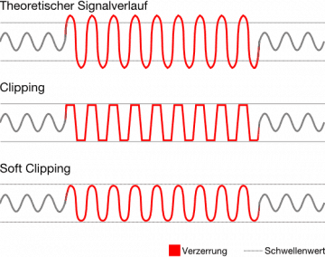

# Text

## Drum Composer Instrumente

Bassdrum, Snare, Low/Mid/Hi Toms, bzw. Congas, Rimshot, Claves, Handclap oder Maracas, Cowbell, Cymbal (Crash-Becken), Open und Closed Hi-Hat

## Effekte Und Filter

### Amp

Nachbildung von Gitarren-Verstärkern

### Gate

Unterdrückung leiser Abschnitte. Es wird ein Minimum-Pegel festgelegt.

Gut bei Vocals

### Kompressor Und OTT

Verringerung der Dynamik

Klang: aufdringlicher und aggressiver

### Eq

Gain der Frequenzen Manipulieren

### Overdrive

kontrollierte Form des Clipping

Klang: übersteuert

### Saturator

Hierbei werden die Signale leicht verzerrt und bekommen dadurch eine Färbung. Meist werden dadurch bestimmte Frequenzbereiche betont und Obertöne hinzugefügt. Dadurch klingt ein Sound satter und setzt sich im Gesamtmix besser durch.