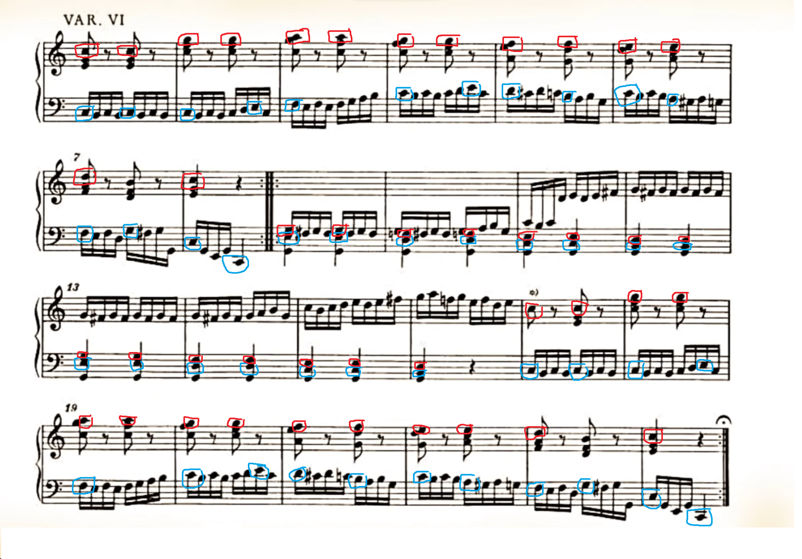

# Variationen

### Original

- neue Komposition
- erste Veröffentlichung
- eigene Inspiration
- Originalität
- der Individualität des Komponisten zuzurechnen
- Gestaltungs- / Schöpfungshöhe
- Keine Zufallskunde

### Bearbeitung

- Vorlage zu erkennen
- Inspiration des neuen Komponisten
- neue Wirkung
- vom Original abhängig
- neue Bestandteile geistiger Schöpfung
- umfassende Änderungen, doch ausreichende Nähe zum Original

### Variation

- Veränderung von Motiv, Thema oder ganzen Musikstückes
- Es kann melodisch, harmonisch, rhythmisch oder dynamisch verändert werden (z.B. Tempo, Artikulation, Tonart, Tongeschlecht, Klangfarbe, Melodie, Begleitung)
- Variation lässt einen neuen Charakter entstehen
- Original noch erkennbar
- Thema mit Variationen (Barock, Klassik, Romantik):
    - aus einem Thema längere Stücke
    - Mit einer Reihe von Variationen versucht der Komponist, das Thema immer wieder mit neuen Variationsideen zu zeigen.

### Variationsreihen / Variationsmodelle

- Variationen über ein Melodie-Modell
    - Grundtöne des Melodie Themas bleiben erhalten
    - Rest wird verändert
- Variationen über ein Bass-Modell
    - Grundtöne des Bass Themas bleiben erhalten
    - Rest wird verändert

### Variationsarten

- Melodievariationen
    - Figuralvariation, auch ornamentale Variation genannt
    - Das Thema wird mit musikalischen Figuren umspielt (Umspielungen, Durchgangsnoten, Wechselnoten)
- Rhythmische Variationen
    - Veränderung der Tonwerte
    - Veränderung der Taktart
    - Veränderung des Tempos
- Harmonische Variationen
    - Tongeschlechts von Dur → Moll (Minore Variation)
    - Tongeschlechts von Moll → Dur (Majore Variation)
- Charaktervariation
    - Variation entfernt sich am weitesten vom Thema
    - Charakteränderung durch Veränderung des Tongeschlechts
    - Charakteränderung durch Veränderung des Rhythmus
- Änderung des Stimmverlaufs
    - Melodie / Bass fällt teilweise weg
    - Länge und Harmonik bleiben erhalten
- Kontrapunktische Variation
    - Komposition einer Gegenstimme (Verflechtung von Motiven)
    - freie Imitation (freie Veränderung des Themas mit den oben genannten Variationsmöglichkeiten)

### Grundbegriffe der Bearbeitung

### Sampling

Verwendung einer fertigen Musikaufnahme oder, häufiger, eines kleinen Ausschnitts daraus in einem anderen (neuen) Musik-Track. Samples werden oft klanglich bearbeitet oder verfremdet. Extremformen des Samplings sind Macrosampling (Verwendung ganzer Songs, die Herkunft des Samples ist klar) und Microsampling (Verwendung winziger Schnipsel, bei denen die Herkunft meist nicht mehr zu erkennen ist).

### Looping

mehrfache direkte Wiederholung eines (meist kurzen) Abschnitts einer Musikaufnahme, eines Samples oder einer Spur. Häufig werden musikalische Sinneinheiten geloopt, z.B. Motive, Riffs oder ganze Bass-Lines und mit anderem Audiomaterial kombiniert. Auch das Looping sehr kurzer Long-Ausschnitte ist möglich.

### Cutting

Vorgang des Ausschneidens eines (häufig auch sehr kurzen) Teils einer Musikaufnahme. Durch kurze Cuts können in einer Aufnahme z.B. plötzliche Tempo-Schwankungen erzeugt werden. Samples entstehen durch Cuts.

### Multitracking

Übereinanderlegen mehrerer separat aufgenommener Spuren / Tracks, sodass sie gleichzeitig erklingen.

### Filtering

Klangliche Bearbeitung von Audiomaterial. Filtering macht den Klang einer Aufnahme z.B. schärfer, halliger oder trockener, verfremdet ihn, reichert ihn mit neuen Klangfarben an etc. Oft eingesetzte Filter sind Höhen- und Bass-Filter sowie verschiedene Verzerrungs-Effekte.

## Aufgabe 3

### Variation 6

- Artikulation: Klang Pausen zwischen den Tönen in der Melodie, Töne werden nicht gehalten
- Figuralvariation (Umspielungen) im Bass
- Die Notenwerte sind in der Melodie auf ein Achtel gekürzt
- Die Begleitung spielt Sechzehntelnoten
- Akkorde statt einzeln gespielte Noten in der Melodie (Grundton bleibt erhalten)
- Verzierungen in der Melodie weggelassen
- Durch die Sechzehntelnoten in der Bassstimme wirkt das Stück schneller, obwohl es das gleiche Tempo hat.
- Töne in der Begleitung werden mit Durchgangsnoten verbunden
- Stimmkreuzung von Takt 16 auf 17 (Melodie und Begleitung tauschen)
- Melodie in Terzen in der Mittelstimme (mittlerer Ton im Akkord) ab Takt 9 bis 16 mit gleichbleibendem G im Bass
- ab Takt 17 Melodie wieder in der Oberstimme der Akkorde und Bass umspielt die Basslinie des Themas
- → Variationen über ein Melodie-Modell

### Variation 8

- Kanonischer Anfang
- Melodie Variationen: Umspielungen des Themas
- Melodie des Themas bleibt teilweise in Halbe Noten erhalten (erster Abschnitt / Takt 1 bis 8)
- Vollständige Bassveränderung
- Minore Variation
- Charaktervariation aufgrund von Veränderung des Tongeschlechts und des Rhythmus
- Aufspaltung der oberen Stimme in den Takten 3 bis 8
- → Variationen über ein Melodie-Modell

### Variation 11

- Rhythmische Variation: langsameres Tempo (Adagio)
- Charaktervariation (auch zwischen erstem und zweiten Teil der Variation)
- Melodievariation
- Veränderung des Rhythmus
- Figuralvariation (Umspielungen) in der Melodie

## Aufgabe 4

### Variation 6

### a und b

### c

nr. 8 und 11