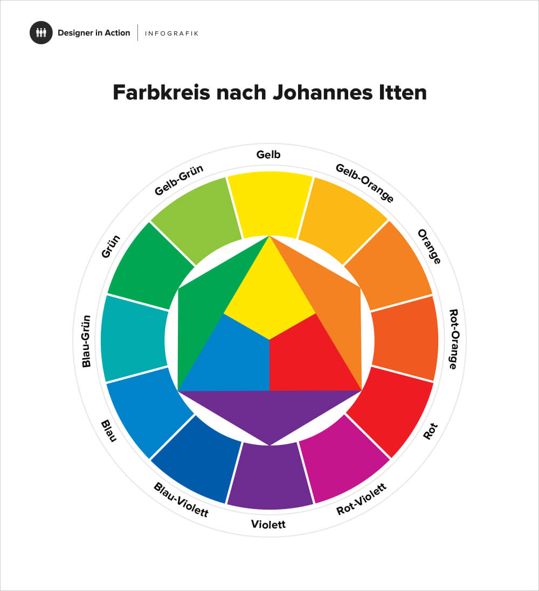
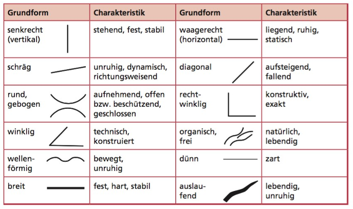

# Klausurthemen

## Themen

- Werkanalyse
    
    [Napoleon überschreitet die Alpen - Bildanalyse](Klausurthemen/Napoleon%20u%CC%88berschreitet%20die%20Alpen%20-%20Bildanalyse.md)
    
    - Thema: Form und / oder Farbe
    - Art: Portrait
- Bild einer Kunstströmung zuordnen

## Farbe

### Farbkontraste

- Farbe-an-sich-Kontrast
    
    Wenn mindestens drei Farben unterschiedlicher Farbrichtung zusammen stehen. Stärkster Farbe-an-sich-Kontrast bilden die Grundfarben (Gelb, Rot, Blau). Je mehr sich die Farben von den Grundfarben entfernen, desto schwächer ist der Kontrast.
    
- Hell-Dunkel-Kontrast
    
    Die Wahrnehmung von Hell und Dunkel ist von entscheidender Bedeutung für das Unterscheiden von Flächen und Formen. Der größte Hell-Dunkel-Kontrast entsteht durch Schwarz und Weiß. Der Kontrast ist stark ausgeprägt, wenn aufgehellte und gedunkelte Töne zusammenwirken.
    
- Kalt-Warm-Kontrast
    
    Der Kontrast zwischen warmen und kalten Farben ist am stärkten ausgeprägt, wenn es keine Nebenkontraste gibt bzw. diese stark zurücktreten. Zu warmen Farben gehören Gelb, Gelborange, Orange, Rotorange, Rot, Rotviolett. Kalte Farben sind Gelbgrün, Grün, Blaugrün, Blau, Blauviolett, Violett
    
- Komplementärkontrast
    
    Der Kontrast bildet sich aus den im Farbkreis diametal gegenüberliegenden Farben. Durch den Kontrast steigert sich in ihrer Leuchtkraft.
    
    
    
- Simultankontrast
    
    Der Simultankontrast ist ein Kontrast, welcher unser Farbsehen mit am meisten beeinflusst. Egal in welchem Zusammenhang eine Farbe wahrgenommen wird, wird gleichzeitig, also simultan, die komplementäre Ergänzung mit wahrgenommen und diese strahlt dann wieder auf die Ausgangsfarbe über.
    
- Qualitätskontrast
    
    Der Qualitätskontrast bezeichnet den Kontrast zwischen gesättigten, leuchtenden Farben und stumpfen, getrübten Farben. Der reine Qualitätskontrast entsteht dann, wenn der Farbton in seiner getrübten und reinen Ausrichtung gleich bleibt.
    
- Quantitätskontrast
    
    Der Kontrast bezeichnet das Größenverhältnis zwischen verschiedenen Farbflecken.
    

### Farbton

Beschreibt die Farbrichtung, also die Zugehörigkeit einer Farbgruppe gleicher Wellenlänge

### Helligkeit

- Bunte Farben besitzen eine eigene Helligkeit dem Farbton entsprechend (Gelb, Rot, Grün, Violett)
- Eine Farbe kann aufgehellt oder abgedunkelt sein
- Durch das Aufhellen oder Abdunkeln wird die Farbe gedämpf, d.h. die Farbe verliert an Reinheit und Leuchtkraft (Trübung)

### Intensität (Reinheit, Intensität)

- reinbunte Farben sind intensiv und gesättigt (Rot, Gelb und Blau**)**

### Eigenwert und Darstellungswert

Eine Farbe hat einen Eigenwert, wenn sie ohne Rücksicht auf das dargestellte Objekt verwendet wird und das Objekt dominiert. In solchen Darstellungen wirkt die Farbe an sich und soll nicht eine Eigenschaft des Objekts abbilden. Das Gegenteil ist der Darstellungswert.

### Symbolfarbe

Farbigkeit widerspiegelt symbolische Bedeutung, vor allem dargestellter Personen oder Figuren. Dabei wird mit dem höchsten Symbolrang der Farbe der höchste Materialwert verknüpft. Der Eigenwert der Farbe wird betont.

|  | Wirkung | Symbolische Bedeutung |
| --- | --- | --- |
| Gelb | erregend, warm, heiter, extrovertiert, grell, aufdringlich, stolz | Freundlichkeit, Optimismus, Leichtsinn, Verschwendung, Neid, Eifersucht, Verrat |
| Orange | anregend, lebhaft, heiter, warm, exotisch, aktiv | Freude, Lebhaftigkeit, Spaß, Lebensbejahung, Ausgelassenheit |
| Rot | stark erregend, belebend, erwärmend, kraftvoll, exzentrisch | Kraft, Erregung, Aktivität, Dynamik, Temperament, Leidenschaft, Liebe, Feuer, Leben (Blut), Freude, Aggressivität, Wärme, Tatendrang |
| Violett | introvertiert, statisch, extravagant, traurig, sehnsüchtig, melancholisch, unnatürlich, niederdrückend | Macht, Theologie, Spannung, Unlust, Eitelkeit, Selbstbezogenheit, Verzicht, Beunruhigung |
| Blau | beruhigend, etwas deprimierend, friedlich, ernsthaft, sehnsüchtig, kalt, fern, unendlich | Sympathie, Beständigkeit, Ruhe, Frieden, Sammlung, Vertiefung, Hoffnung, Harmonie, Passivität, Sauberkeit |
| Grün | beruhigend, sanft, freundlich, heiter, natürlich, gesund, frisch, jung | Frische, Ruhe, Entspannung, Unreife, Jugend, Natur, Frühling, Hoffnung |
| Braun | Zurückgezogen, schwer, altmodisch, warm, gemütlich | Bequemlichkeit, Anpassung, Faulheit, Fäulnis, Alter |
| Weiß | rein, illusionär, steril, leer, leicht, oben | Reinheit, Ordnung, Unschuld, Leichtigkeit, Vollkommenheit |
| Schwarz | pessimistisch, traurig, geheimnisvoll, schwer, feierlich, ernst, verschlossen, unten | Ende, Negation, Auflehnung, Trauer, Einengung, Hass, Schmutz, Egoismus, Funktionalität, Unglück |
| Grau | charakterlos, wandelbar, unfreundlich, arm, grausam, heimlich | Neutralität, Gleichgültigkeit, Nüchternheit, Elend, Sachlichkeit, Schlichtheit, Funktionalität |

### Lokal- oder Gegenstandsfarbe

Farbe charakterisiert die Oberflächenbeschaffenheit und die Stofflichkeit der dargestellten Objekte bis ins Detail (hart, weich, glatt, glänzend, transparent). Die Eigenfarbe wird ohne den verändernden Einfluss von Licht und Schatten abgebildet.

### Erscheinungsfarbe

Farbige Darstellung der Objekte unter Berücksichtigung bestimmter Beleuchtungsverhältnisse. Besondere Bedeutung erhält die veränderte Farbigkeit durch den Einfluss von Licht und Schatten, Luft und Atmosphäre im Impressionismus.

### Ausdrucksfarbe

Die Farbe steht nicht mehr im bezug zum realen Gegenstand. Farbe wird zum Ausdrucksträger von inneren Zuständen, Gefühlen und Stimmungen. Sie soll ein inneres Vorstellungsbild sichtbar machen und eine eine starke psychische, emotionale Wirkung hervorrufen. Besonders die Maler des Expressionismus arbeiteten mit Ausdrucksfarben.

### Absolute Farbe

Eine Anzahl gleicher oder ähnlicher Elemente ist zentral oder dezentral, symmetrisch oder asymmetrisch, geordnet oder ungeordnet in einem relativ ausgewogenen Verhältnis an bestimmten Teilen der Bildfläche verteilt angeordnet. Von absoluter Farbe spricht man, wenn der Farbe als Ausdrucksmittel eine völlig eigenständige Bedeutung zugemessen wird.

## Formen

### Formrichtigkeit / Formgenauigkeit (stark/schwach)

- die Formrichtigkeit ist stark, wenn ein Abgleich mit der Wirklichkeit gegeben ist

### Formbegrenzung

- Klarheit und Eindeutigkeit der Abgrenzung einzelner Motivteile (→ kein Merkmal naturalistischer Darstellung)

### Formqualität

- ≠ Wertung
- Charakter der Form
    - spitz
    - kantig
    - organisch

### Formkontraste

Wenn runde und sehr kantige oder spitze Formen aufeinander treffen.

### Geometrische Formen

- Kreis
- Oval
- Dreieck
- Rechteck
- (regelmäßige) Polygone

### Linien

### Flächen

## Bildraum

Ist ein Raum bzw. Bildtiefe zu erkennen?

Der Bildraum beinhaltet die Gliederung des Formates in räumliche Bezüge (Vordergrund, Mittelgrund, Hintergrund). Die Bildtiefe entsteht beispielsweise durch

- Höhenunterschiede
- Überdeckungen
- Staffelungen
- Größenunterschiede

## Plastizität

Plastizität meint die dreidimensionale Wirkung von Objekten (im Gegensatz zur Fläche). Plastisch erscheint alles, was ein Volumen hat. Mittels bewusst eingesetzter Helligkeitsabstufungen von Hell zu Dunkel oder umgekehrt können Bildgegenstände plastisch erscheinen und räumliche Wirkungen erzielt werden.

## Beleuchtung

Die Beleuchtung beschreibt den Ort der Lichtquelle und die Art der Lichtquelle (natürliche, künstliche Lichtquelle).

## Komposition / Ordnungsprinzipien und Bildaufbau

geometrische Grundformen (Kreis, Oval, Dreieck, Rechteck), Reihung, Ballung, Staffelung, Streuung, Fülle, Leere, Chaos, Überschneidungen, Perspektive, bestimmte Proportionen, Goldener Schnitt, harmonisch, ausgewogen, spannungsvoll, dynamisch, gleichmäßig, ausgeglichen, Muster / Struktur / Ornament, Bildebenen (Vordergrund, Mittelgrund, Hintergrund), Bildausschnitt, Ballung, Reihung, Streuung, Fläche, Punkt, Linie

## Blickführung

Schwerpunkt, Blickpunkt, Akzent, wo schaut der Betrachter als erstes hin?

## Perspektive / Profil, Bildausschnitt

### Gesichtsprofil

- Frontalansicht
    - streng wirkende, hieratisch funktionierende Darstellung, bei der das Gesicht von vorn auf den Betrachter gerichtet ist
- Dreiviertelprofil
    - Gesicht ist leicht aus der Frontalansicht herausgedreht, sodass die dem abgewandte Seite sehr stark verkürzt wiedergegeben wird, wodurch sich die Proportionen im Gesicht verändern / verschieben
- Halbprofil
    - die Mitte zwischen dem Profil und dem Dreiviertelprofil, beide Augen sind noch zu sehen
- Viertelprofil
    - eine äußerst selten vorkommende Ansicht, bei der die Profilansicht überwiegt und das zweite Auge gerade noch zu erkennen ist (üblich in der Frührenaissance)
- Profilansicht
    - reine Seitenansicht
- verlorene Profil
    - selten vorkommende Ansicht von hinten, bei der nur noch die Konturen der Wangenknochen zu sehen sind. Das Gesicht dreht sich über das Profil hinweg in die Bildtiefe ein

### Bildausschnitt

- das Kopfstück
- das Schulterstück
- das Bruststück
- die Halbfigur
- das Kniestück
- die Ganzfigur

## Kunstströmungen

- Impressionismus (1860 - 1920)
    
    eine helle Palette, lockerer, skizzenhafter Farbauftrag mit sichtbaren Pinselstrichen, Malen vor dem Motiv und meist Pleinairmalerei (Malen im Freien)
    
- Expressionismus (1905 - 1925)
    
    Die subjektive und emotionale Ausdrucksfähigkeit des Künstlers steht im Mittelpunkt, die jeweiligen Bildmotive wurden auf markante Formelemente reduziert, die Kompositionen flächenhaft gehalten und die traditionelle Perspektive aufgelöst, häufig Audrucksfarbe
    
- Surrealismus (1920 - 1933)
    
    Ungewohnte oder gegensätzliche Gegenstände, Themen, Landschaften und Motive werden miteinander verbunden und bilden in ihrer Konstellation einen Kontrast, der das Bild verfremdet. Surrealistische Bilder lassen sich nicht rational erklären.
    
- Neue Sachlichkeit (1918 - 1933)
    
    eine nüchterne, realitätsbezogene sowie leicht verständliche Alltagssprache, eine reduzierte und präzise Ausdrucksweise, wenig Spielraum für Interpretationen, Die handelnden Figuren zeigen keine Gefühle, eine distanzierte, beobachtende Haltung.
    
- Fauvismus (1905 - 1910)
    
    Farben hell, verschärft, vor allem aber rein, das heißt, sie sind nicht miteinander vermischt
    
- Dadaismus (1916 - 1922)
    
    wollte für ein neues, freies Kunstverständnis sorgen, das nicht durch Konventionen bestimmt wird. Alles sollte Kunst sein können.
    
- Kubismus (ab 1906/08)
    
    Anwendung multipler Perspektiven, die Verwendung geometrischer Formen, eine monochromatische  (ein Farbton mit verschiedenen Helligkeiten und Reinheiten) Farbpalette und eine abgeflachte Bildebene.
    

## Kompositionsskizzen

- vereinfachende Skizze (Reduktion des Bildes auf seine wesentlichen Bestandteile (Linien nachzeichnen))
- Teilflächen (Reduktion des Bildes auf vorherrschende Flächen / Formen)
- Räumlichkeit (Welche Gestaltungsmittel werden eingesetzt um räumliche Tiefe zu erzeugen?)
- **Bildachsen / Ordnungsstruktur (Abgleich mathemat. / geometrischer Strukturen mit tatsächlichen Gefügen (gedacht, ausgesprochen)**
- **Liniengefüge (Vorherrschende Linien & Richtungen (horizonlale / vertikale, diagonale; gerade, gekrümmte; etc.))**
- **Kompositionsschema (Lässt sich im Bild ein bekanntes Kompositionsschema auffinden?)**
- Formen / Strukturen (Formensprache im Bild, auffällige Strukturen, Malspuren, Duktus, Texturen, Materialität)
- Figur - Grund (Platzierung der zentralen Bildfigur vor dem Hintergrund / im Umraum)
- Hell-Dunkel (Reduktion des Bildes auf Hell – Dunkel (hier nicht auf Kontraste bunter Farben!)
- Farbe (möglich hier: Farbpalette, Farbauftrag, Einsatz der Farbe (LokalF. / ErscheinungsF. / ), Farbqualität, Gesamtkolorit, etc.)
- Kontraste (Farbkontraste (Kalt-Warm, Komplementär, Qualität, Quantität, etc.); Formkontraste)
- **Blickführung (Nachvollzug der Blickführung im Bild; Kennzeichnung des Bildzentrums (Achtung: manchmal gibt es mehr als eines)**

[AB_Kompositionsskizzen_mit Schwerpunktsetzung.pdf](Klausurthemen/AB_Kompositionsskizzen_mit_Schwerpunktsetzung.pdf)

| Kompositionselemente | Mögliche Darstellungen | Analyse / wie wirkt es? |
| --- | --- | --- |
| Format | • Hochformat
• Querformat
• ... | • standhaft
• ruhig
• haltlos
• ... |
| Bildzonen | • Vorder-, Mittel-, Hintergrund (Wo sind die Grenzen?)
• homogene Farbflächen
• ... | • Verhältnis zu einander
• Wie ist der Übergang?
• ... |
| Formen | • Welche Formen erkenne ich?
• Statische/dynamische Formen?
• Wie sehen die Formen aus (organisch/vereinfacht/geschwungen/...)?
• Formkontraste?
• ... | • ruhig
• statisch
• dynamisch
• laut
• instabil
• harmonisch
• ... |
| Linien & Achsen | • Vertikale
• Horizontale
• Diagonale
• Kreuzungen von Linien
• Richtungsweisende Linien
• ... | • negativ/haltlos (fallende Diagonale)
• positiv/kraftvoll (steigende Diagonale)
• standhaft/dynamisch
• Welche Richtungen ergeben sich?
• ... |
| Kompositionsform | • Dreieckskomposition
• Kreiskomposition
• Ovalkomposition
• Bilddiagonale
• ... | • geschlossen
• offen
• Welche Beziehung ergibt sich daraus?
• ... |
| Gliederung | • Teilungen
• Goldener Schnitt
• Schwerpunkte/optische Zentren
• Bezug zum Format
• ... | • harmonisch/disharmonisch
• klar, vollkommen
• störend
• ... |
| Ordnungsprinzipien | • Reihung
• Rhythmen
• Gruppierung
• Ballung
• Zerstreuung
• Symmetrie/Asymmetrie
• ... | • ausgeglichen, geordnet
• disharmonisch, instabil
• interessant
• regelmäßig/unregelmäßig
• Wo befinden sich sie Anordnungen?
• ... |
| Formatbezug | • Füllen des Formats
• Einnehmen des Formats
• Zurückgestellt | • lädt zum Weiterdenken ein
• sprengend, mächtig
• klein, leise
• ... |
| Blickführung | • In welcher möglichen Reihenfolge werden die Bildelemente angeschaut?
• ... | • geordnet, ruhig
• hektisch, verwirrend
• ... |