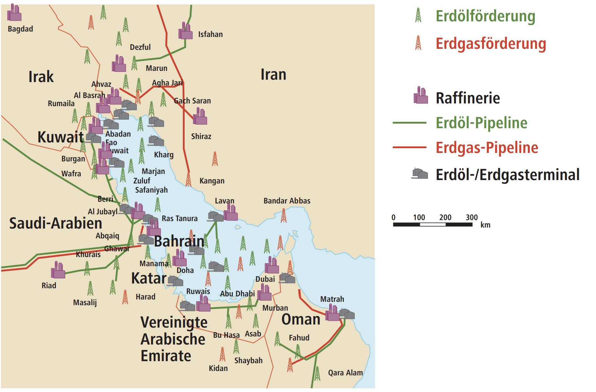

## Aufgaben

1. Aufgaben 1-5 und 8 auf dem Arbeitsblatt

## Ergebnisse

### Aufgabe 1

- Wieso wird das Öl so lange bei den Stationen gelagert?
- Warum befindet sich die Raffinerie und die Verarbeitung nicht an nah aneinander liegenden Standorten?
- Wie anfällig ist dieses System?

### Aufgabe 2

#### Erdölvorkommen im Persischen Golf

### Aufgabe 3

Die Vulnerabilität ist ein Maß für die Anfälligkeit eines Systems. Es umfasst nicht nur Raum, System oder Personen, sondern auch Handlungskapazitäten in Form von Bewältigungs- und Anpassungsprozessen. Die Erdölversorgung beinhaltet in ihrer Versorgungskette mehrere Risikoelement, wie zum Beispiel das austreten von Öl im Meer während der Förderung oder die Brandgefahr. 

### Aufgabe 4

Politische und militärische Unruhen bzw. nationale Konflikte entlang des Persischen Golfs bilden ein hohes Risiko für das Austreten und Brennen von Öl bei einem Angriff auf einen Öltanker oder Ölanlagen.

### Aufgabe 5

## Anhänge