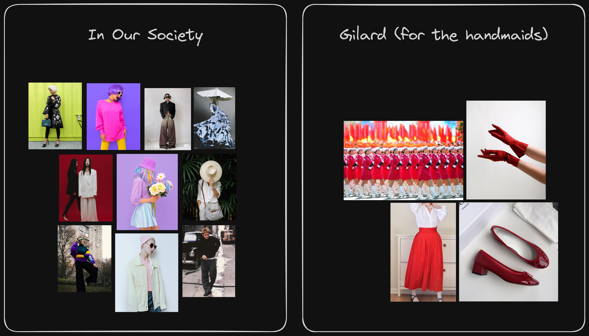
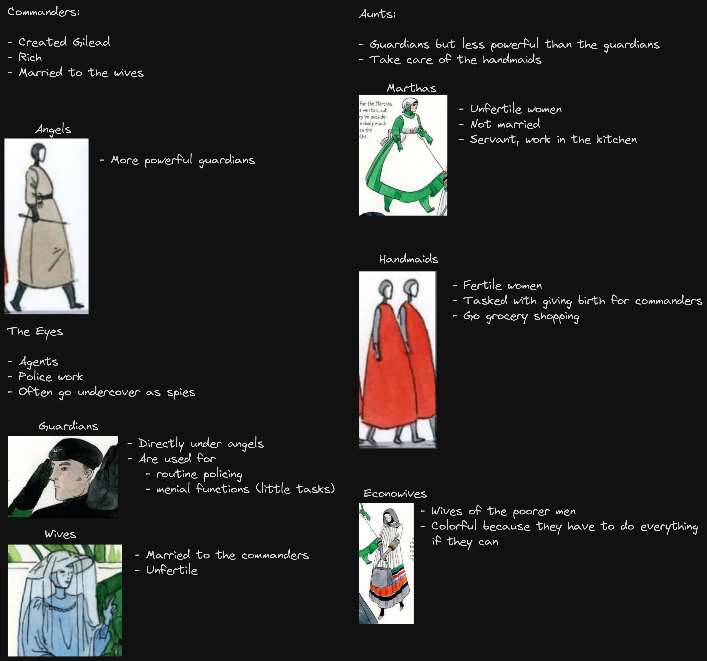
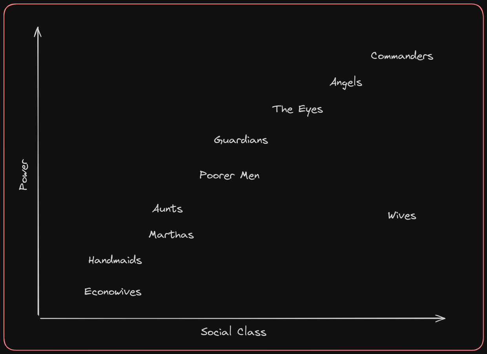

## The first two chapters

### Protagonist

- Oppressed → clothing (wings
- Careful and calculated
	- Dialogue
	- Inner monologue
- Extremely focused on details
- Longs/years for a different life (past)

### Atmosphere

- Dark, subdued, depressing
	- Communication between handmaids
- Mysterious
	- Lack of background
	- Detailed descriptions

### Setting

- Oppressive society
- Frightening
==> Dystopian world

## Clothes and dressing routines

### First and second chapter

- Oppressive atmosphere: Created through detailed descriptions of the setting, including the former gymnasium turned sleeping quarters with its reminders of a past life and the presence of guards and strict rules.
- Tense and suffocating environment: Offred describes feelings of loneliness, anticipation, and fear, highlighting the constant surveillance and danger she faces.
- Protagonist portrayal: Offred is depicted as a woman yearning for connection and freedom, but constrained by the oppressive regime, leading to a sense of isolation and longing.
- Interactions: Interactions between characters, such as Offred's exchange with Rita, reveal the power dynamics and societal norms that dictate behavior, reinforcing the restrictive nature of their society.

### 1. Routine of getting dressed for a normal school

- Typically, I’d start with casual underwear
- Pants: depends on the weather
	- Sunny and no rain: rather light colored pants → also dark colors but this type of weather is ideal for light clothing as they don’t less dirty
	- Rainy: rather jeans/pants with dark colors → so that they don't get dirty so quickly
- Shirt: depends on the pants → oversized or not oversized
	- Mostly basic shirts in various colors, but a color that matches to the rest of my clothings
- Shoes: depends a lot on the weather and I decide the same like with my pants
	- Light shoes only in good weather
	- Winter / Summer: boots / sneakers
- Depending on the season, I might layer with a sweater or hoodie, or wear a jacket/coat if it's cold outside.
- Almost everyday, I wear a watch, more specifically a smart watch

### 2. Offred’s Getting dressed

* Shoes: Red flat-heeled shoes.
* Gloves: Red gloves.
* Clothing: Ankle-length red skirt and white wings (bonnet).
* Accessories: Shopping basket.
* Other items: Noticed umbrellas in the hat-and-umbrella stand, including one assigned to her that is red.

### 3. Comparison

The way people get dressed for school and the way Offred gets dressed is very different. When people get ready for school, they think about the weather and choose clothes accordingly, like light pants for sunny days or dark jeans for rainy days. But Offred doesn't have that choice. She has to wear a specific outfit assigned by the government. Offred wears a red skirt and white bonnet, and she always carries a shopping basket. Her clothes are a symbol of her low status in society. While students can choose their clothes based on personal preference and the weather, Offred doesn't have that freedom. Her outfit shows how much control the government has over her life. It's a reminder of her lack of freedom and how she's forced to obey the rules, even when it comes to something as simple as choosing what to wear.

### 4. Functions of clothes

#### In our society

- **Expression of Identity**: Clothes in our society often serve as a means of expressing personal identity, style, and individuality. People choose clothes based on their preferences, cultural background, and social status.
- **Fashion and Trends**: Fashion plays a significant role, with trends constantly changing and influencing clothing choices. People may follow fashion trends to feel connected to current cultural movements or to express their uniqueness.
- **Practicality and Comfort**: Clothes are also chosen for their practicality and comfort, especially considering factors like weather conditions, activities planned for the day, and personal preferences for materials and styles.
- **Social Signifiers**: Clothing can serve as social signifiers, indicating one's occupation, social status, or affiliations with certain groups or subcultures.

#### In Gilead

- **Uniformity and control**: Clothing in Gilead serves primarily as a tool for uniformity and control. The government mandates specific attire for different social classes and roles, eliminating individual expression and identity through clothing.
- **Symbol of subjugation**: The clothing assigned in Gilead symbolizes the subjugation of individuals to the oppressive regime. It reinforces the power dynamics and the lack of personal autonomy experienced by the citizens.
- **Enforcement of gender roles**: Clothing in Gilead rigidly enforces gender roles, with distinct dress codes for men and women. Women are forced to wear modest, concealing garments that symbolize their inferior status and lack of agency.
- **Punitive measures / signifiers**: In Gilead, clothing can also serve as a means of punishment or control, such as the red robes worn by Handmaids, which mark them as social outcasts and subjects of government-sanctioned sexual exploitation.

#### The house

##### Words used to describe the house

###### Words

- driveway
- assigned
- own
- past
- dining
- most
- neatly
- back
- white
- front
- family house
- rich
- fleshtones and hints
- gate

###### Passages

"In the driveway, one of the Guardians assigned to our household is washing the car. That must mean the Commander is in the house, in his own quarters, past the dining room and beyond, where he seems to stay most of the time."

"He lives here, in the household, over the garage. Low status: he hasn’t been issued a woman, not even one. He doesn’t rate: some defect, lack of connections. But he acts as if he doesn’t know this, or care."

"I walk along the gravel path that divides the back lawn, neatly, like a hair parting. It has rained during the night; the grass to either side is damp, the air humid."

"I open the white picket gate and continue, past the front lawn and towards the front gate."

„The carpet bends and goes down the front staircase a”

##### Further words

- clean
- fresh
- expensive

### Collages

### Characters

