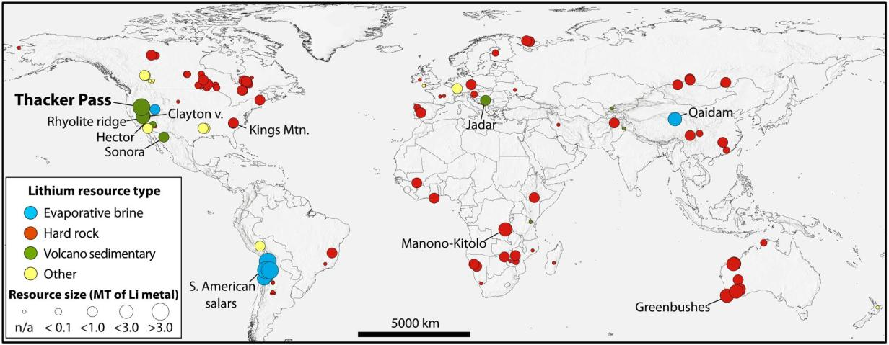

---

title: Lithium
tags: []
---

## Steckbrief

### Verwendungsmöglichkeiten

- Batterien/Akkus
	- Lithium kann leicht Elektronen abgeben → hohe Spannungen koennen entstehen
- Keramik
- Schmiermittel

### Vorteile

- Leicht
- Hohe Energiedichte
- Hohe Nachfrage

### Quellen

- Festgestein
- Vulkansediment
- Solen (salzhaltige Lösung)

### Räumliche Verteilung

- Die wichtigsten Förderländer von Lithium sind derzeit Australien, Chile und China.
- Globale Reserven: 22 Millionen Tonnen

## Preisentwicklung

### Reale Preisentwicklung

- Volatil
- Tendenz steigend

### Prognostizierte Preisentwicklung

- Exponentiell steigend

### Gründe für die Preisentwicklung

- Nachfrage steigt, da es keine wirklichen Alternativen gibt, und immer mehr Geräte Akkus benötigen
- Begrenztes Angebot: Rohstoffvorkommen ist begrenzt
- E-Autos sollen Verbrenner-Autos ersetzen → Produktion steigt → Nachfrage steigt (ein Auto benötigt etwa 8-10 Kilo)

### Szenario

#### Minimale Preisprognose

- Weitere Vorkommen
- Natrium- und Zink-Ionen Batterien
- Effizientere Rohstoffgewinnung

#### Maximale Preisprognose

- Nachfrage steigt
- Angebot bleibt gleich / sinkt