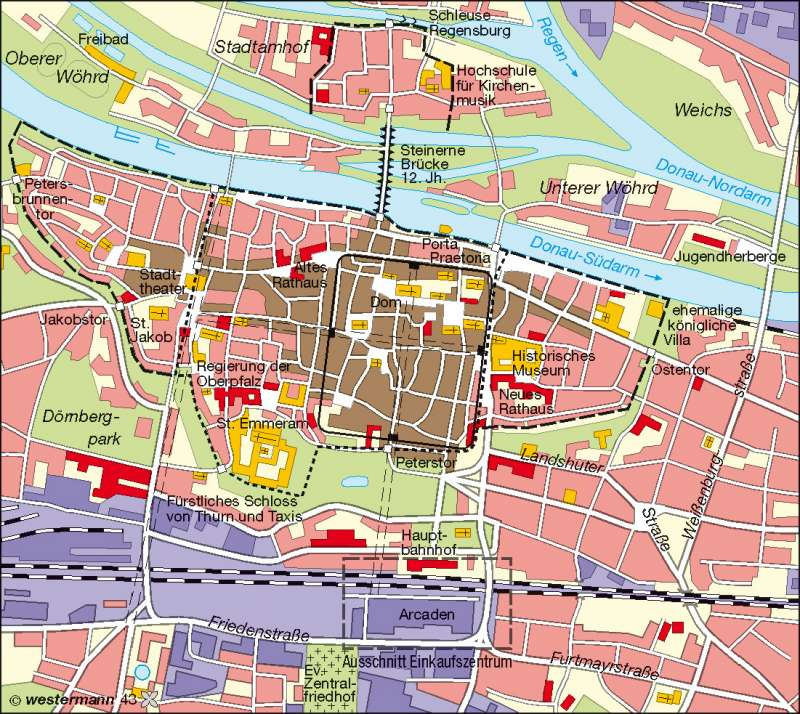
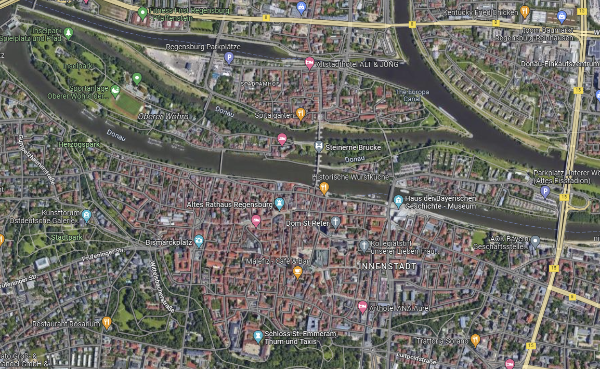

# Regensburg

## Lokalisierung

- Regensburg ist eine Stadt in Bayern, Deutschland.
- Die Stadt liegt im Südosten Deutschlands, in der Region Oberpfalz.
- Regensburg befindet sich am Ufer der Donau, etwa 130 Kilometer nordöstlich von München.
- Die Stadt hat eine Fläche von etwa 80 Quadratkilometern und eine Bevölkerung von rund 200.000 Einwohnern.

## Historisch Genetische Entwicklung

### Entstehung (200 N. Chr.)

- Die Stadt wurde im Jahr 179 n. Chr. von den Römern gegründet und hieß damals Castra Regina
- Idealgrundriss einer römischen Stadt
- Funktion: Römerkastell (erbaut von Kaiser Marc Aurel (Kastell Castra Regina)
- Stadtmauer mit 4 Stadttoren
- von jedem Stadttor führt eine Straße ins Zentrum
- viele Kirchen entsteheno

### 1. Stadterweiterung Mittelalter (11. Jh.)

- Die Erweiterung trug zur Stärkung der Position Regensburgs als wichtiger Handelsplatz und Verbindung zwischen Ost und West bei.
- Die Stadt blieb im Mittelalter eine bedeutende Handelsstadt und war Mitglied der Hanse.
- Die Erweiterung umfasste den Bau von neuen Stadtmauern und die Erweiterung der Siedlung auf das linke Donauufer.

### 2. Stadterweiterung Mittelalter (Mitte Des 14. Jh.)

- Die Römer bauten zwei Auxiliarkastelle in Regensburg, um die strategisch günstige Fernverkehrssituation zu sichern.
- Die Lage des Kastells zeigt, dass die römischen Lokatoren bei der Anlage von Castra Regina die günstigen topographischen Faktoren zu nutzen wussten.
- Das Castrum wurde an einem Ort angelegt, wo die Donau sich auf zwei oder drei Arme verteilte, wodurch sich eine günstige Möglichkeit zu ihrer Überquerung (Furt) bot.
- In diesem Grenzkastell war eine etwa 6000 Mann starke Legion stationiert.
- Westlich dieser Anlage entstand eine zivile Lagervorstadt (canabae legionis) mit Tausenden von Einwohnern.
- Noch heute zeugen die Reste des mächtigen Nordtores, der Porta praetoria, von der ehemaligen Bedeutung des römischen Stützpunktes.

- Nach dem Niedergang des Römischen Reiches im 5. Jahrhundert erlosch die römische Herrschaft.
- Regensburg wurde zur Hauptstadt der germanischen Bajuwaren und zum Residenzort ihres Herzogs.
- Mit den Bajuwaren begann die erneute Besiedlung, vermutlich in der Nordostecke des Kastells bei der späteren Dompfarrkirche Niedermünster.
- Das kräftige Wachstum der Stadt zwischen dem 8. und 9. Jahrhundert belegt unter anderem der Bau eines karolingischen Doms ab dem ausgehenden 8. Jahrhundert.
- Die Wegeführung in der frühmittelalterlichen Stadt weicht vom römischen Straßennetz ab und lässt sich vermutlich auf die Umgehung von Schuttbergen der Kastellbauten zurückführen.

- Bis 1300 n. Chr. erfolgte eine beachtliche Verdreifachung der Siedlungsfläche
- Regensburg wuchs durch Fernhandel, insbesondere den Salz- und Eisenhandel mit der Oberpfalz

