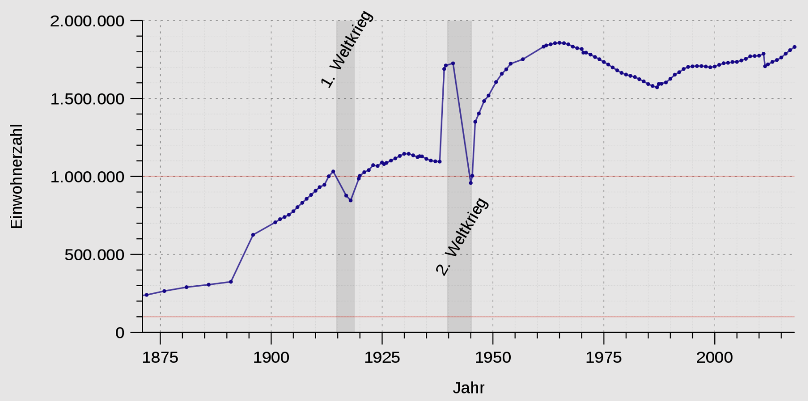

# Städtebau

# Ist Hamburg Eine Stadt?

### Wohndichte Und Arbeitsplatzdichte

2.455 Einwohner je km²

1.249.247 Arbeitende

### Gliederung

Es gibt 7 Bezirke

104 Stadtteile

### Wirtschaftsformen

Hafen, Bahnhöfe

### Sozialräumliche Gliederung

### Kulturformen

Elbphilharmonie (Konzertsaal), Museen

### Bevölkerungswachstum

# Historische Stadtentwicklung

## Römisch

### Wo?

Rhein und Donau

### Grundriss

- quadratisch
- Straßen sind in eimem Karomuster angelegt
- Hauptstraßen vom Zentrum zu den Stadttoren
- Römisches Forum und Marktplatz im Zentrum
- Stadtmauer mit jeweils einem Stadttor in der Mitte an den Kanten der Mauern
- Häuser vom Zentrum nach außen hin gebaut. Bebauung nimmt zur Stadtmauer hin ab
- meist an Flüssen
- Landwirtschaft außerhalb der Stadt
- Kolosseum
- Amphitheater

### Wann?

50 v. Chr. bis 350 n. Chr.

## Mittelalterlich

### Wo?

gleichmäßig verteilt, kein Fokus auf Gewässer

### Grundriss

- rund / eiförmig
- Stadtmauer mit jeweils Stadttoren bei den Haupstraße
- Hauptstraßen gehen vom Zentrum nach außen hin weg
- Abstand zwischen Stadtmauer und Häusern
- Landwirtschaft außerhalb der Stadt
- Stadtgraben mit Wasser an der Stadtmauer außen
- Kirche, Markplatz

### Wann?

650 bis 1460

## Barock

### Wo?

Gebiete in der Nähe von Flüssen

### Grundriss

- Schlosspark
- Zwei Stadttore an der Hauptstraße
- bebaute Gebiete, die sich vom Zentrum nach außen hin in eine Richtung erstrecken, in Form eines Dreiecks
- idyllische Gärten und Grünanlagen
- Schloss im Zentrum
- kreisförmige Straße um das Schloss
- Hauptstraße zum Schloss (im rechten Winkel zur quer-Hauptstraße)
- an der Mündung der Hauptstraße zum Schloss
    - Kirche
    - Plätze

### Wann?

1560 bis 1760

## Industriezeitalter

### Wo?

Gebiete in der Nähe von Wasserstraßen und Bahnlinien

Es entstehen Stadtwachstumsregionen

im Westen

### Grundriss

- Hauptstraßen zu Fabriken und Industriegebieten
- Industriegebiete und Fabriken an Zugstrecken / Gleisen
- Landwirtschaft außerhalb der Stadt
- Wohnhäuser und Wohngebiete in der Nähe der Fabriken und Industriegebiete
- Häuser mit Innenhöfen
- Rathaus, Kirche, Markplatz im Zentrum
- Grünanlagen und Parks
- Eisenbahn und Bahnhöfe

### Wann?

1800 bis 1900

## 20. Jahrhundert

### Wo?

in den Stadtwachstumsregionen

### Grundriss

- Wohngebiete im Umfeld von Fabriken und Industriegebieten
- Verkehrsknotenpunkte wie Bahnhöfe und U-Bahnhöfe
- Grünflächen und öffentliche Plätze
- Einkaufsstraßen und Einkaufszentren
- Wohnsiedlungen und Wohnhäuser in den Wohngebieten
- Gebäude mit mehreren Etagen und Wohnungen in den Wohnsiedlungen
- Verwaltungsgebäude (z.B. Rathaus und Verwaltungsbüros)

### Wann?

1900 bis Heute

# Stadt Definition

Basierend auf der historischen Entwicklung kann man sagen, dass eine Stadt eine Siedlung ist, die sich durch eine komplexe Struktur auszeichnet, die aus Wohnhäusern, Verkehrsknotenpunkten, Straßen, Gewerbegebieten, Grünflächen, öffentlichen Plätzen, Einkaufsmöglichkeiten und Rathäusern besteht. Es besteht eine enge Verflechtung zwischen Umland und Stadt. Außerdem ist die Stadt wichtig fürs Umland. Eine Stadt braucht einen Einpendlerüberschuss