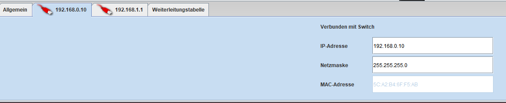
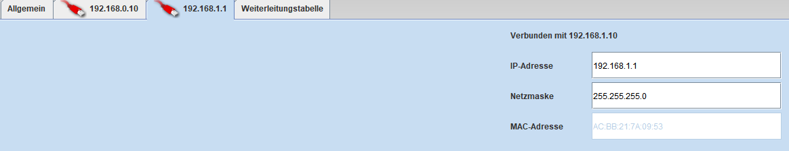

# Netzwerke Und Datenbanken

# Inhalt

- MySql Datenbanken
- Netzwerke
- Caesar-Verschlüsselung

# MySql Datenbanken

### Select

SELECT column1, column2, column3 FROM table

Gibt den Inhalt der angegebenen Spalten wieder

### Where

### WHERE Column1 = “string”

Setze eine Bedingung

Operatoren:

= ist gleich

< kleiner als

> größer als

### WHERE Column1 = “string” AND Column2 > 10

### Sortierung

### ORDER BY Column ASC

Sortiert die Datensätze aufsteigend (ASC = ascending)

### ORDER BY Column DESC

Sortiert die Datensätze absteigend (DESC = descending)

### Aggregatfunktionen

### Count

Zählt die Datensätze (Rows / Zeilen)

### Min

gibt den kleinsten Wert zurück

### Max

gibt den größten Wert zurück

# Netzwerke

## Begriffe

### **Bit**

Ein Bit kann genau zwei Zustände haben: 0 oder 1

Es handelt sich hierbei um die kleinste elektronische Einheit

### Byte

Ein Byte besteht aus acht Bits. Somit kann ein Byte 28, also 256 Zustände annehmen

Es handelt sich hierbei um die kleinste Datenmenge

### IP-Adresse

Eine IP-Adresse (“Internet Protocol”) ist eine individuelle Adresse, die ein Gerät im Internet oder auf einem lokalen Netzwerk identifiziert.

Es handelt sich hierbei um eine normierte Ziffernfolge, die vom jeweiligen Netzwerk abhängt.

### MAC-Adresse

Die MAC-Adresse ist eine eindeutige, nicht veränderbare Adresse eines Geräts in einer Datenverbindung.

### Router

Ein Router ist ein Hardwaregerät, das als Verbindungspunkt zwischen einem lokalen Netzwerk und dem Internet dient. Router verwalten den Internetverkehr und die Daten zwischen Geräten in verschiedenen Netzwerken und ermöglichen es mehreren Geräten, dieselbe Internetverbindung zu nutzen.

### Gateway

Die Gateway stellt zwischen verschiedenen Netzwerken eine Verbindung her, sodass man mit anderen Netzwerken kommunizieren kann.

### DHCP

Das “Dynamic Host Configuration Protocol” dient der Verwaltung von IP-Adressen in einem Netzwerk. Es wird verwendet, um automatisch einzigartige IP-Adressen an Geräte im selben Netzwerk zuzuweisen.

### DNS

Das “Domain Name System” ist für die Zuordnung von IP-Adresse und Domain zuständig, was es einem ermöglicht, mittels der Domain einen Server zu erreichen.

### **Broadcast-Adresse**

Datenpakete mit der Broadcast-Adresse als Zieladresse werden in dem jeweiligen Subnetz an alle Hosts geschickt. Eine Broadcast-Adresse innerhalb eines Netzwerks dient dazu, alle Hosts innerhalb eines Netzwerks zu erreichen. Beispielsweise um Dienste im Netzwerk in Anspruch zu nehmen, bei denen die Adresse noch nicht bekannt ist. Zum Beispiel DHCP für die IPv4-Konfiguration, Datei- und Druckerfreigaben oder einen Gaming-Server.

Über die Broadcastadresse lassen sich Nachrichten an alle Teilnehmer verschicken.

Die Broadcast besteht immer aus dem Netzanteil und als Hostanteil müssen alle Bits gesetzt sein. Bei einer Subnetzmaske von 255.255.255.0 ist die Broadcast 192.168.0.255

## Webserver Einrichten

- Server installieren und starten
- Bei Vermittlungsrechner:
    - IP-Adresse im Server-Konfiguration erstellen (192.168.x.1)
    - IP-Adresse in der Switch-Konfiguration erstellen (192.168.x.1)
- Bei Server:
    - Gateway auf die IP-Adresse stellen, die man im Servertab erstellt hat.
    - Server starten
- Bei PC:
    - Gateway auf die IP-Adresse stellen, die man im Switchtab erstellt hat.

Switch-Konfiguration beim Vermittlungsrechner:

Server-Konfiguration beim Vermittlungsrechner:

## DNS-Server Einrichten

- DNS-Server installieren
- DNS-Server einrichten:
    - Domain aussuchen
    - IP auf die des jeweiligen Webservers stellen
    - Server starten
- User-PC
    - Domain Name Server auf die IP vom DNS-Server stellen

## Mailserver Einrichten

- Mailserver installieren
- Mailserver einrichten:
    - Maindomain einstellen
    - Konten erstellen
- User-PC
    - E-Mail-Programm installieren
    - Konto einrichten
        - Name: Custom
        - E-Mail-Adresse: benutzername@maindomain
        - POP3-Server: IP-Adresse vom Mailserver
        - POP3-Port: 110
        - SMTP-Server: IP-Adresse vom Mailserver
        - SMTP-Port: 25
        - Benutzername: Benutzername vom Konto
        - Passwort; Passwort vom Konto

## DHCP Einrichten

- Auf einem Rechner oder extra Server DHCP-Server einrichten
    - Adress-Untergrenze (meistens: 192.168.x.2)
    - Adress-Obergrenze (meistens: 192.168.x.n+1)
    - Gateway (meistens: 192.168.x.1): wurde beim Vermittlungsrechner festgelegt
    - Manuelle Einstellungen Haken setzen
    - DNS-Server: IP-Adresse des DNS-Servers
- User-PC
    - DHCP zur Konfiguration verwenden aktivieren

## Subnetzmaske Und Boolesches UND

Mit dem booleschem “&” kann man den Netzanteil (Netzadresse / Subnetzadresse) und Hostanteil berechnen Der Netzanteil dient der Wegfindung zum Zielnetz, der Hostanteil der Zustellung zu einem bestimmten Computer im Zielnetz. Die Trennung von Netz- und Hostanteil erfolgt mithilfe der Subnetzmaske.

### Beispiel

Bei einer Subnetzmaske von

Dezimal: 255.255.255.0

Binär: 11111111.11111111.11111111.00000000

und einer IP-Adresse von

Dezimal: 192.168.0.1

Binär: 11000000.10101000.00000000.00000001

kann man den Netzanteil und Hostanteil berechnen:

11111111.11111111.11111111.00000000 (Subnetzmaske)

11000000.10101000.00000000.00000001 (IP-Adresse)

---

11000000.10101000.00000000.00000000 (Netzanteil)

Binär: 192.168.0.0

00000000.00000000.00000000.11111111 (invertierte Subnetzmaske)

11000000.10101000.00000000.00000001 (IP-Adresse)

---

00000000.00000000.00000000.00000001 (Netzanteil)

Binär: 192.168.0.0

Der Netzanteil sagt automatisch auch, was die Netzwerkadresse ist.

### Subnetzmaske Berechnen

Wenn man 4 PCs hat, 1 Router, + Broadcast und Netzadresse, dann ergibt das 7 IPs. Die nächste 2er Potenz ist 2³. Das heißt, dass man 256-2³ rechnet, was 248 ergibt. Somit ist die Netzmaske 255.255.255.248

n = anzahl an Hosts + 3

2^e - n ≥ 0

x = 256 - n^e

255.255.255.x

# Caesar-Verschlüsselung

### Definition

Bei der Caesar-Verschlüsselung wird jeder Buchstabe der Nachricht um eine bestimmte Zahl im Alphabet weitergeschoben. Diese Zahl ist der geheime Schlüssel.

### Beispiel

Wählt man zum Beispiel den Schlüssel 3, so wird aus einem A (1. Buchstabe im Alphabet) ein D (4. Buchstabe), aus einem B ein E, aus einem C ein F usw. Gelangt man bei der Verschiebung über Z hinaus, so wird wieder bei A begonnen. Also wird in dem Beispiel mit dem Schlüssel 3 das X durch A, Y durch B und Z durch C ersetzt.

### Sicherheit

Dieses Verfahren ist sehr unsicher, da ein sicheres Verfahren allein durch die Geheimhaltung des Schlüssels sicher sein sollte. Sobald die Caesar-Verschlüsselung entdeckt wurde, konnte man die Verschlüsselung im “worst case” mit 25 Versuchen knacken, da es nur 25 verschiedene Schlüssel gibt. Da die Verschiebung der Buchstaben linear ist, bringen doppelte Verschlüsselungen keinen Vorteil. In diesem Fall würden sich die Schlüssel einfach addieren.