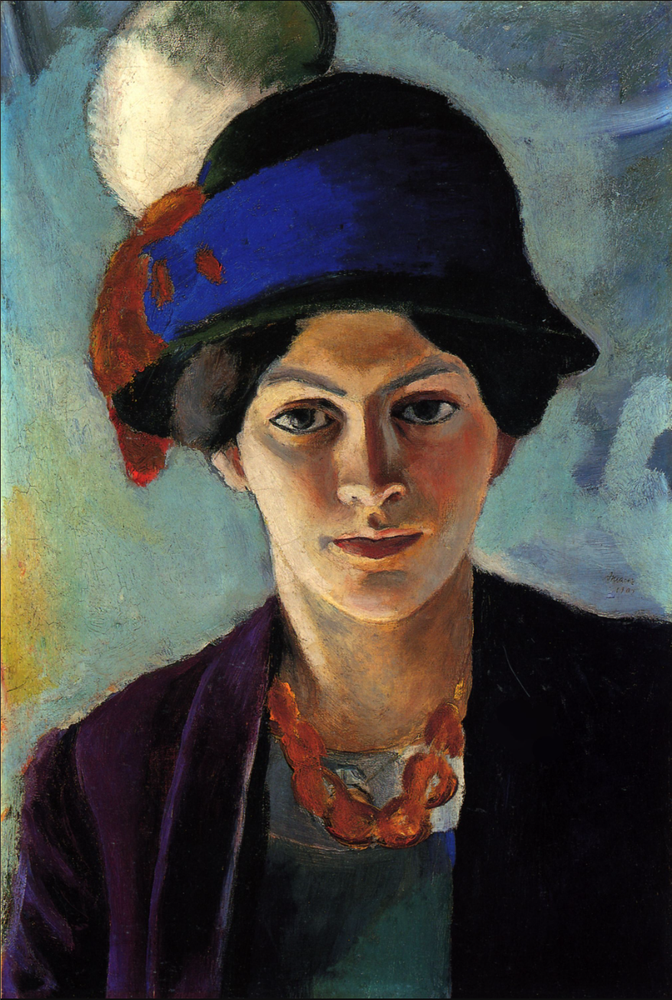
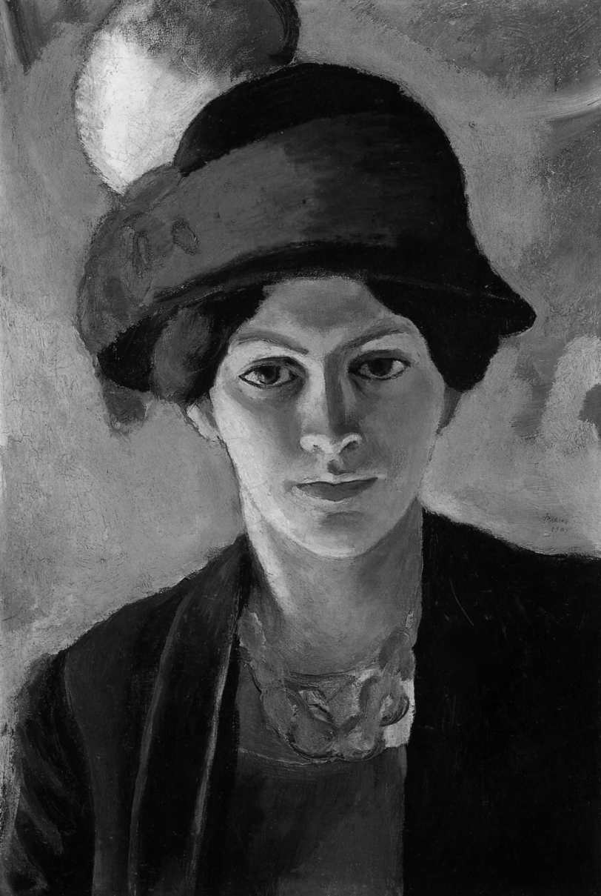
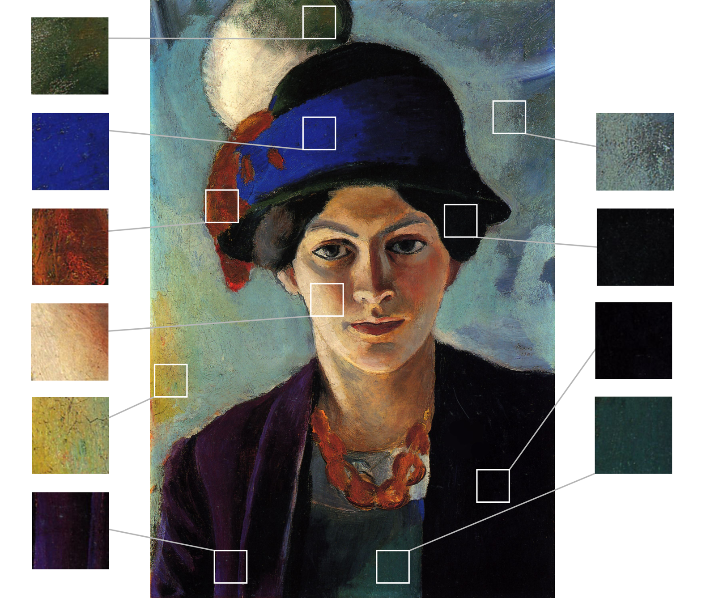

# Bildanalyse Beispiel

## Schreibe Eine Bildanalyse Mit Dem Schwerpunkt Farbe Zum Gemälde

"Porträt der Frau des Künstlers mit Hut" von August Macke (1909), Öl auf Leinwand, 49,7 x 34 cm

### a) Nenne Fünf Adjektive, Die Dir Beim Ersten Betrachten Zu Diesem Porträt Einfallen

- farbintensiv
- bunt
- besonders
- leuchtend
- kontrastreich

### b) Fertige Zur Vorbereitung Mindestens Zwei Kompositionsskizzen Mit Verschiedenen Untersuchungsschwerpunkten Nach Dem Aus Dem Unterricht Bekannten Vorgehen An, Die Dir Für Die Vorbereitung Der Analyse Geeignet Erscheinen. (Tipp: Wenn Die Helligkeit Deines Bildschirms Hoch Eingestellt Ist, Kann Man Das Motiv Sehr Gut Durch Ein Weißes Papier pausen.)

Hell-Dunkel

Farbe

### c) Beschreibe Und Analysiere Das Bild Mithilfe Des AB "Werkbetrachtungsmodell" (siehe Anhang) Mit Schwerpunkt Auf Der Leitfrage: Wie Wurde Das Bildnerische Mittel Farbe Eingesetzt? (Begriffliche Hilfestellungen Bietet Das AB "Vorbereitung Auf Die Klausur" Im Anhang.)

Das Porträtgemälde “Porträt Frau des Künstlers mit Hut” von August Macke ist aus dem Jahr 1909 und lässt sich in die Epoche des Expressionismus einordnen. Das 49,7 x 34 Zentimeter große Ölgemälde befindet sich auf Leinwand. Heute wird es im LWL-Museum für Kunst und Kultur ausgestellt. Das Gemälde zeigt eine Frau mit einem kunstvollem Filzhut. Die Frau trägt eine violett, offen getragene, leichte Jacke, wodurch die dunkel türkise Bluse zum Vorschein kommt. Der Hintergrund besteht aus hell blauen, grünen und braun-gelben schwungvoll aufgetragenen Farbtönen. Im folgenden wird das Gemälde mit Schwerpunkt auf die Leitfrage: Wie wurde das bildnerische Mittel Farbe eingesetzt?, analysiert.

Farbwahl

Das Bild enthält vorwiegend kalte Farben. Durch das Licht erscheint die Farbe des blauen Bandes am Hut sehr intensiv und gesättigt. Bei dem Farbton der Jacke handelt es sich um ein sehr dunkles Violett. Auf der Schattenseite der Kleidung verlaufen die Farben bis ins Schwarze, wodurch der Farbton unkennbar wird. Der Hintergrund hat weniger reine Farben und einen grün, blauen Farbton. Unten links im Hintergrund befindet sich ein gelber Fleck, die einen immer dunkler werdenden Verlauf im Hintergrund entstehen lässt. Die hellen des Hintergrunds und dunklen Farben der Frau bewirken einen hohen Kontrast zwischen Vorder- und Hintergrund. Durch die beiden Grundfarben der roten Feder und des blauen Bandes entsteht ein hoher Farbe-an-sich-Kontrast. Die rote Farbe lässt sich etwas orange schimmernd bei Halskette der Figur wiederfinden. Der Hut hat ein sehr abgedunkeltes Grün, dessen Farbeton gerade so durch das Licht erkennbar ist.

Farbauftrag

Die deckende Malweise zeigt eine einheitliche Farbschicht. 

Malkonzept

Aufgrund der scharfen Umrisse, die nochmals durch dünne schwarze Konturlinien bei hellen Farben betont verstärkt werden, handelt es sich um einen linearen Malstil.

Farbkonzept

X

Licht

Der gelbe Schimmer im Hintergrund könnte die Sonne darstellen. Das weiche Licht bildet den Schatten auf der Figur, welche vorallem im Gesicht bemerkbar wird. Aber auch die Farben werden durch das Licht stark beeinflusst, wodurch sie im Schatten kaum erkennbar sind. Auf den Schultern und am Kinn sieht man ein Glanzlicht. Bei der Kette handelt es sich um Reflexionen des Lichts. Das Licht beleuchtet die Figur von Links und bildet auch den Farbverlauf im Hintergrund, sodass der Himmel von der Lichtquelle weg immer dunkler wird. 

### d) Interpretiere Das Werk Unter Einbeziehung Der Vorausgegangenen Skizzen, Beschreibung Und Analyse

- Der gelbe Fleck dient als Lichtquelle und lässt Farben bis ins Schwarze verlaufen.