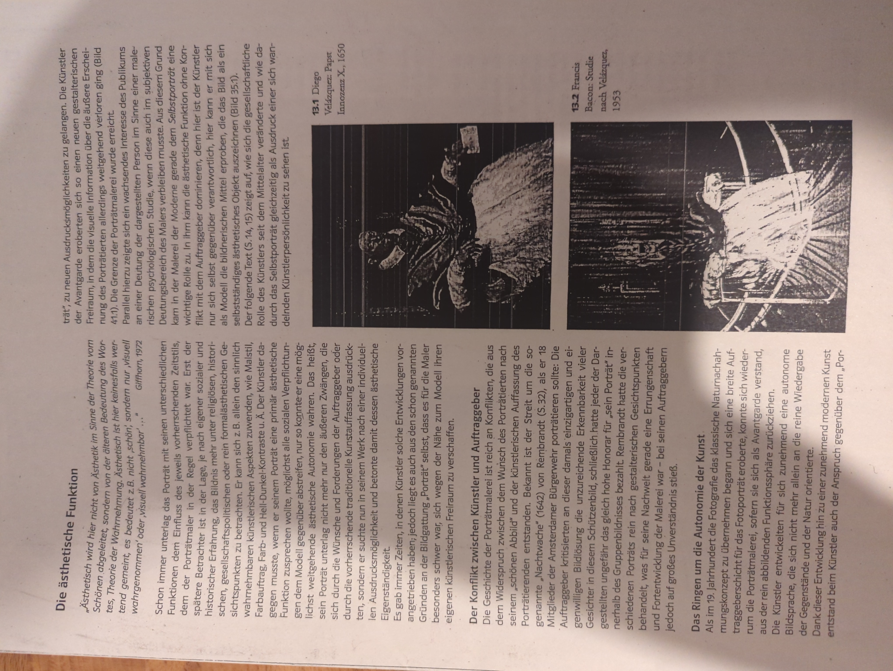
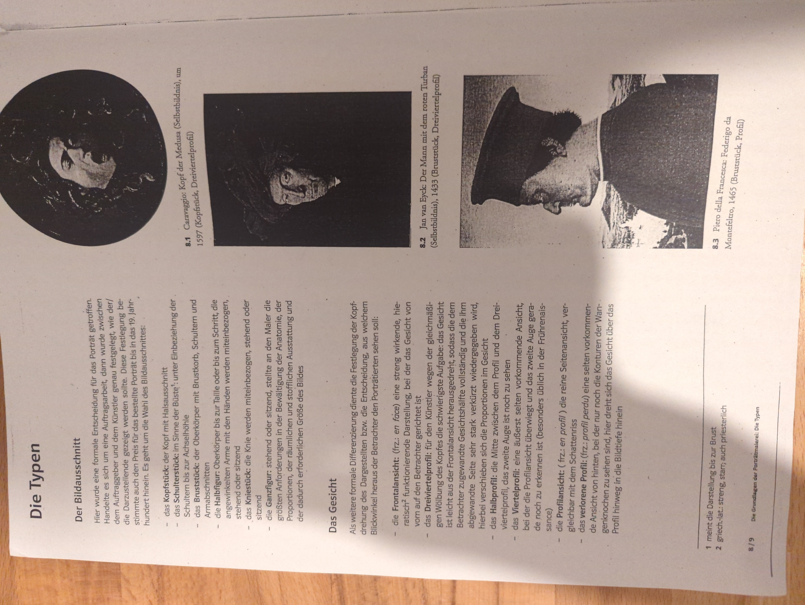
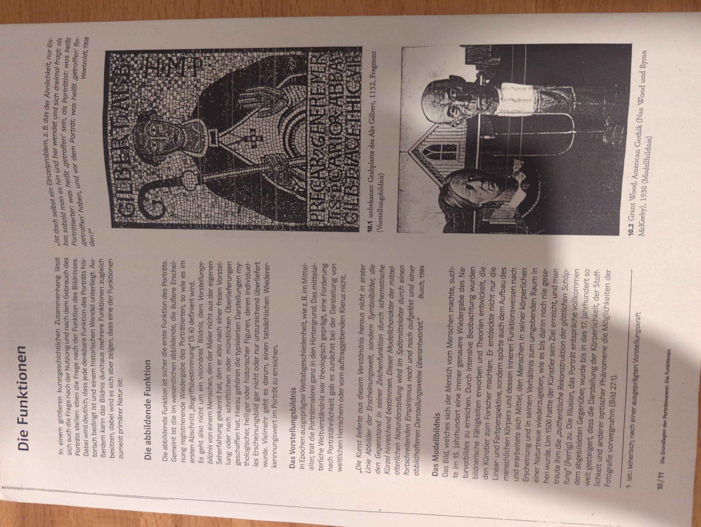
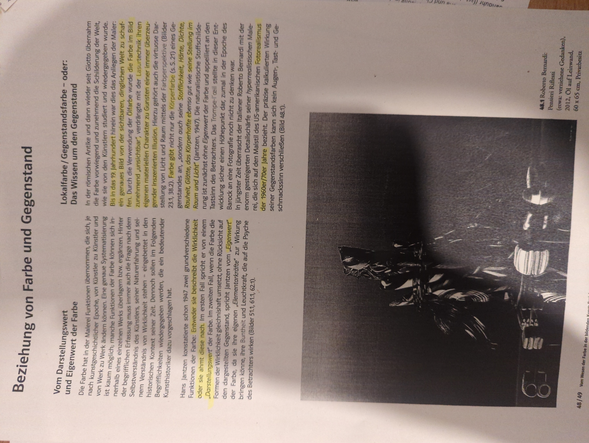
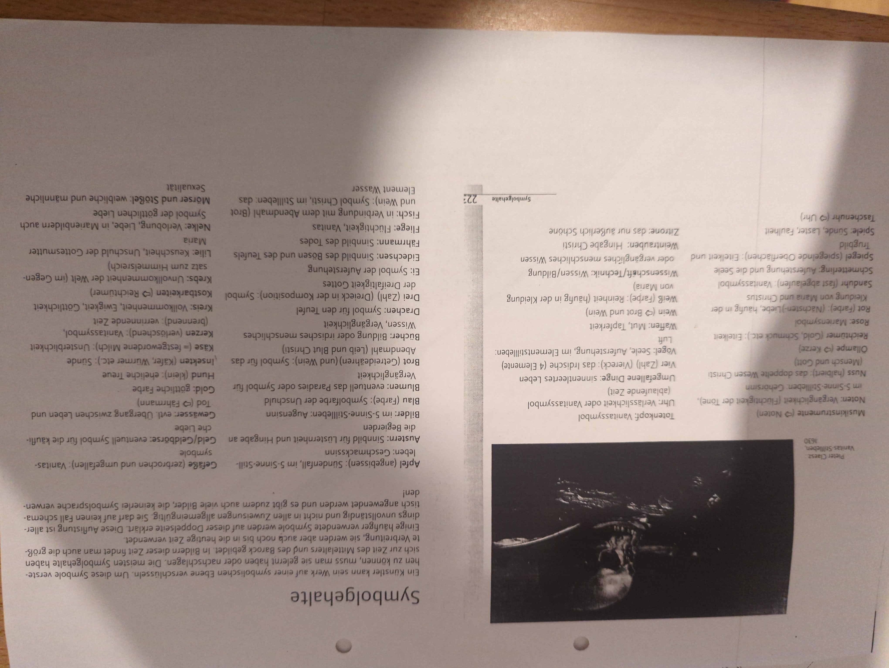
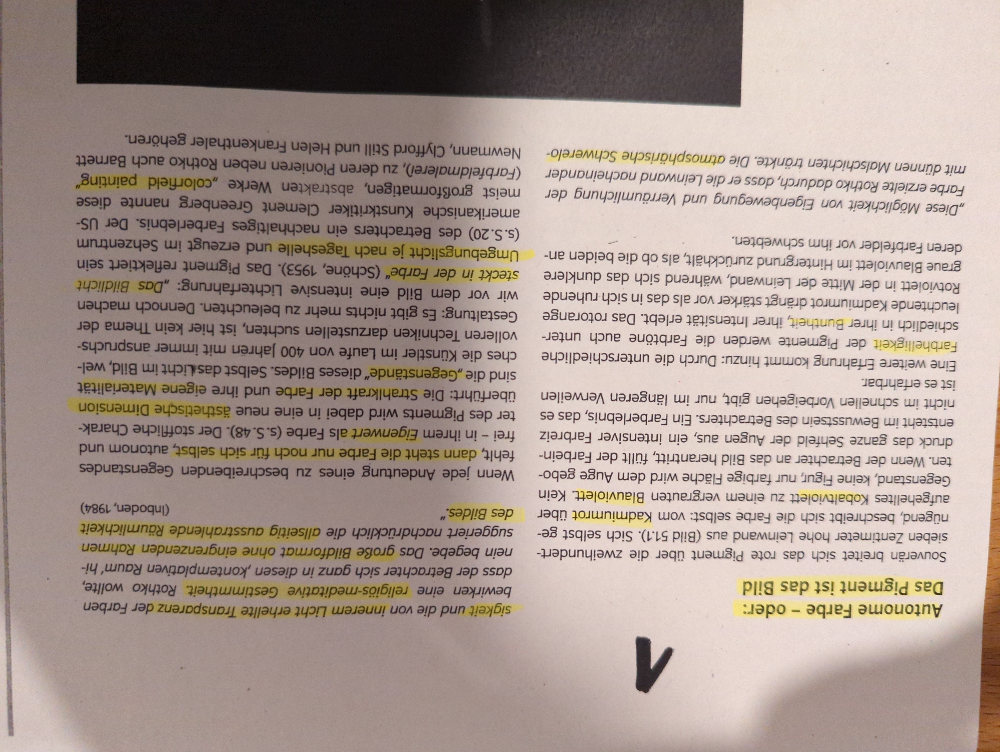

# Glossar

## Links

[Kunst betrachten](https://padlet.com/Fr_C/Kunstbetrachtung)

### Abbildende Funktion

Meistens die erste Funktion des Porträts. Es handelt sich um die äußere Erscheinung registrierende Wiedergabe des Porträtierten. Es geht nicht um ein visionäres Bildnis.

### Abstraktionsgrad

Bei dem Abstraktionsgrad unterscheidet man zwischen naturalistisch und abstrakt. Bei einem hohen Abstraktionsgrad ist der Bezug zum Abbild nur noch in geringem Maße erkennbar.

### Ästhetische Funktion

Ästhetik wird hier im Sinne der Theorie der Wahrnehmung abgeleitet. Ästhetisch ist nicht wertend gemeint. Es bedeutet also nicht “schön”, sondern “visuell wahrnehmbar”.

### Bildausschnitt

- das Kopfstück
- das Schulterstück
- das Bruststück
- die Halbfigur
- das Kniestück
- die Ganzfigur

### Blickführung

Schwerpunkt, Blickpunkt, Akzent, wo schaut der Betrachter als erstes hin?

### Deutungsmöglichkeiten

Lebendig, harmonisch, angenehm, weich, freundlich, traurig, hart, statisch, rational, nüchtern

### Duktus

Linienführung beim Malen, vorsichtig, konzentriert, kontrolliert, dynamisch, chaotisch, schnell

### Eigenwert Und Darstellungswerts

Eine Farbe hat einen Eigenwert, wenn sie ohne Rücksicht auf das dargestellte Objekt verwendet wird und das Objekt dominiert. In solchen Darstellungen wirkt die Farbe an sich und soll nicht eine Eigenschaft des Objekts abbilden. Das Gegenteil ist der Darstellungswert.

### Farbauftrag

lasierend, deckend, pastos (dickflüssig aufgetragene Farbe, wodurch man sie spüren kann)

### Farbe

unbunte Farben (Schwarz und Weiß), Farbpalette, Farbfamilie (Farben gehören so lange zu einer Farbfamilie, wie der Grundton im Verhältnis der Mischung überwiegt), Farbintensität / Farbsättigung (wahrgenommene Buntheit, Je reiner eine Farbe ist, desto gesättigter und damit intensiver erscheint sie)

### Format, Bildraum Und Malgrund

Hochformat / Querformat / Quadrat / nicht geometrisch, Format, Größe / Maße, Proportionen, Bildelemente spezifisch / zufällig im Bildraum platziert (ausnutzen, sprengen, definieren), Malgrund: Leinwand, Holz, Papier, Metall

### Formbegrenzung

Weich, Verschwommen, hart, präzise

### Formqualität

Rund, eckig, organisch, fließend, geschwungen, verspielt

### Gesichtsprofil

- Frontalansicht
    - streng wirkende, hieratisch funktionierende Darstellung, bei der das Gesicht von vorn auf den Betrachter gerichtet ist
- Dreiviertelprofil
    - Gesicht ist leicht aus der Frontalansicht herausgedreht, sodass die dem abgewandte Seite sehr stark verkürzt wiedergegeben wird, wodurch sich die Proportionen im Gesicht verändern / verschieben
- Halbprofil
    - die Mitte zwischen dem Profil und dem Dreiviertelprofil, beide Augen sind noch zu sehen
- Viertelprofil
    - eine äußerst selten vorkommende Ansicht, bei der die Profilansicht überwiegt und das zweite Auge gerade noch zu erkennen ist (üblich in der Frührenaissance)
- Profilansicht
    - reine Seitenansicht
- verlorene Profil
    - selten vorkommende Ansicht von hinten, bei der nur noch die Konturen der Wangenknochen zu sehen sind. Das Gesicht dreht sich über das Profil hinweg in die Bildtiefe ein

### Motiv

bezeichnet den kennzeichnenden bzw. thematisch prägenden inhaltlichen Bestandteil, Einzel- / Gruppenporträt, Mythologie, Feste, Handwerk, berufliche Situationen, Landschaftsmotive (Gewässer, Berge, Strand), Liebesszenen

### Komposition / Ordnungsprinzipien Und Bildaufbau

geometrische Grundformen (Kreis, Oval, Dreieck, Rechteck), Reihung, Ballung, Staffelung, Streuung, Fülle, Leere, Chaos, Überschneidungen, Perspektive, bestimmte Proportionen, Goldener Schnitt, harmonisch, ausgewogen, spannungsvoll, dynamisch, gleichmäßig, ausgeglichen, Muster / Struktur / Ornament, Bildebenen (Vordergrund, Mittelgrund, Hintergrund), Bildausschnitt, Ballung, Reihung, Streuung, Fläche, Punkt, Linie

### Kontrast

Hell-Dunkel, Komplementärkontrast (Ittens Farbkreis diametral gegenüberliegende Farben, größtmögliche Verschiedenheit zwischen zwei Farben), Farbe-an-sich-Kontrast (Gelb, Rot, Blau, Weiß und Schwarz, umso mehr Mischfarben, desto weniger Kontrast → Wirkung geschwächt)

### Porträtausschnitte

Ganzfigur, Kniestück, Amerikanisch, Halbfigur, Bruststück, Büste, Kopfbild

### Symbolische Funktion

Die symbolischen Funktionen beziehen sich vor allem auf die sozialen oder psychologischen Aspekte eines Objekts. Welche sozialen, gesellschaftlichen und kulturellen Aspekte und welche Wertigkeiten vermittelt das Objekt?

# Konzeptpapier

### Gib Den Inhalt Deiner Arbeit Wieder

- Welchen inhaltlichen Schwerpunkt hast du gesetzt?
- Was hat dich während der Arbeit daran inhaltlich beschäftigt?
- Welche Aussage willst du mit der Arbeit treffen?
- Nenne Handlung, Motiv, Personen, Umgebung, verwendete Objekte, Gegenständlichkeit

### Begründe Deine Formalen Entscheidungen

- Wie genau wurden Materialien, Techniken und Verfahren eingesetzt?
- Welche Rolle spielte der Zufall bei der Entstehung der Arbeit?
- Nenne Künstlerische Mittel, Malmittel und Malgrund, Maltechnik und Farbauftrag, Duktus, Format und Bildraum, Komposition / Ordnungsprinzipien …

### Stelle Begründete Vermutungen Über Die Wahrscheinliche Betrachterwirkung an

- Welcher Kontext ist wichtig zu bedenken?
- Was kann der Betrachter erkennen / tun?
- Welche Gefühle werden vermutlich geweckt?
- Werden Aktionen ermöglicht?
- Wo wird eigene Erfahrung / Interpretation des Betrachters wichtig?

### Erläutere Und Begründe, Inwiefern Die Arbeit Die Aufgabenstellung Erfüllt

- Welchen Aspekt der Thematik hast du fokussiert?
- Welche Sicht hast du auf das Thema?

# Bildanalyse

[Bildanalyse](Bildanalyse.md) 

# Dokumente Zur Vertiefung

