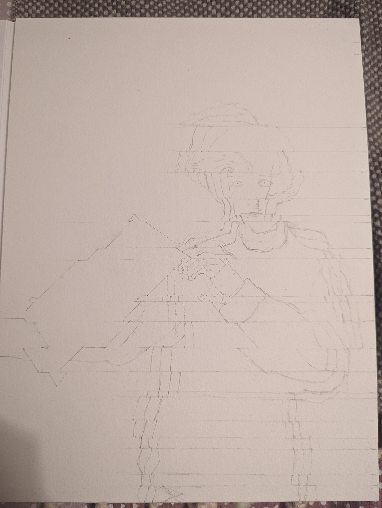
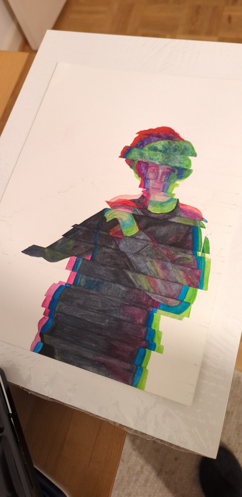

# S1: Semesterarbeit Konzeptpapier

Das Bild befindet sich auf einem Aquarellpapier und ist 24 x 32 Zentimeter groß. Da ich zuerst eine Malplatte gekauft habe, die nicht für Aquarellfarben geeignet ist, habe ich mein noch vorhandenes Aquarellpapier verwendet. Ich hoffe, dass dies die Bewertung des Bildes nicht beeinflusst. Ich habe auch überlegt, ob ich das Bild z.B. auf eine Malplatte klebe, aber das wäre meiner Meinung nach Verschwendung der Malplatte. Eine Alternative wäre, das Bild einzurahmen. Im folgenden werde ich die Bestandteile des Bildes erkläre

Der Hintergrund zeigt das Weltall. Ich habe mich für diesen Hintergrund entschieden, da dies den Hintergrund in der Komposition darstellen soll, in der ich mich befinde. Während der Kreation dieses Bildes habe ich an einem Trailer gearbeitet, bei dem das Weltall in Mittelpunkt steht. Die Figur befindet sich in der Komposition und zieht eine weiße Fläche auf. 

Unter Komposition ist der Bildinhalt im Kompositionsrahmen zu verstehen, wenn ich z.B. mit After Effects arbeite. After Effects ist ein Programm, mit dem man visuelle Effekte und Kompositionen kreieren kann.

Die weiße Fläche beschreibt meine Zukunft, die im Vergleich zum Hintergrund noch ungeschrieben ist. Rational gesehen ist die Fläche, da ich mich in einer Komposition befinde, ein geometrisches Element, das ich in die Komposition aufziehe. Außerdem soll die dynamische Bewegung meine Flexibilität verdeutlichen, also die Veränderung der größe der weißen Fläche. 

Der Hintergrund bzw. genauer gesagt die Sterne stellen die unendlichen Möglichkeiten dar, die mir offen stehen und die meine Zukunft prägen können. Die Figur wurde mit einem Glitch Effekt gemalt, welcher Abschnitte auf der horizontale Achse verschiebt, und einer “Chromatic Aberration”, die die Zusammensetzung der Farbe verschiebt. Diese visuellen Effekte verwende ich häufig in meinen Kompositionen in After Effects. 

Aufgrund der ”Chromatic Aberration” wird mein Gesicht leicht verdeckt und etwas unkenntlich. Dies soll eine Form vom introvertiert und ruhig sein zum Ausdruck bringen.

Skizze

Zwischenergebnis

digital erstellte Vorlage und Idee für das Selbstportrait.