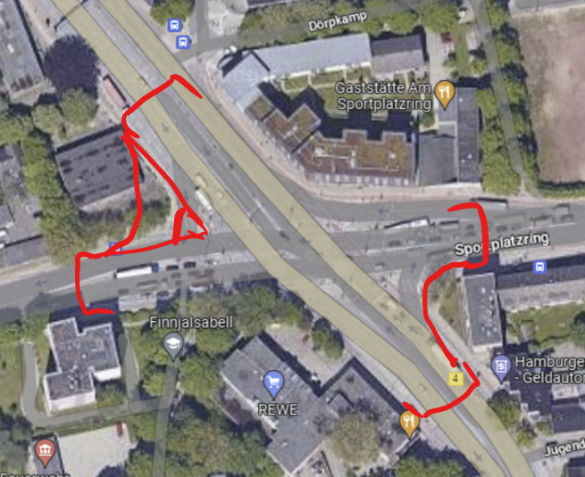

# Semesterarbeit

# Moodboard

[Files | Adobe Creative Cloud](https://assets.adobe.com/id/urn:aaid:sc:EU:56117d20-8ad0-447a-8cd3-6ff711511e96?view=published)

# Plakat

[Semesterarbeit: Plakat](Semesterarbeit/Semesterarbeit%20Plakat.md)

# Orte

## Breite Hauptstraße

Kielerstraße

## Alternativ Leerstehende Gebäude

# Idee

Man nimmt eine breite Straße und setzt auf die Straßen Module, mit denen man Häuserreihen bilden kann. In meiner Vision der Zukunft wird nicht jeder ein Auto besitzen, sondern stattdessen das Fahrrad für kurze Strecken, und den Zug für längere Strecken nehmen. Im Untergeschoss könnte es Einkaufszentren geben, da diese im Vergleich zu Wohnungen oder Büros kein natürliches Licht benötigen. Möglicherweise sind Schächte für etwas Licht eine gute Option, um möglichst viel künstliches Licht zu vermeiden. Letzlich soll das Produkt ein Modul von vielen sein. Ich werde bei diesem Modul wahrscheinlich ein Kreuzungsmodul entwerfen, dass Nicht-Kreuzungsmodule verbindet. Man könnte beispielsweise in die Mitte des Moduls einen Innenhof gestalten, der mithilfe von Treppen mit dem Tiefgelegenden Einkaufszentrum verbunden ist. Es ist außerdem wichtig, die Module mit nebenstehenden Gebäuden zu verbinden, um Barrierefreiheit zu schaffen, indem man über Brücken, oder Glastunnel die Nachbarstreppenhäuser mit Fahrstühlen mit den Modulen verbindet.

[[Konzeptpapier]]

# Inspiration

- The Line: Neon-Projekt in Saudi-Arabien
- Bjarke Ingels

- Hannover Hbf
- https://www.vitra.com/de-de/about-vitra/campus/architecture/architecture-dome

# Informationen / Quellen

![[_Multilayer_City[1].pdf]]
![[kunst_infos.jpg]]

# Wichtige Aspekte

- Begrünung
- Erreichbarkeit von außen
- Verbindung zu Wohnung außerhalb (z.B. Brücker etc.)
- öffentliche Räume / Zonen
- konkreter Ort (Kieler Str., Kreuzung Sportplatzring)
- Fahrstühle aus benachbarten Häusern für Barrierefreiheit
- Innenhöfe: schafft Licht

- auf der Seite der Wege, die Wände entfernen und durch Stützpfeiler ersetzen
	- Übergänge in den Boden, wenn die Seite der Wohnungen wechselt
- Auf der langen flachen Seite Treppen mit dazwischen jeweils Sitzmöglichkeiten
- Funktion des Daches:
	- Regenschutz
	- Photovoltaik-Anlagen
	- Grünflächen
- Lichtdurchlässige Flächen, wo die Sonne reinscheinen würde
- Anbindung zum Untergrund (Züge, Einkaufszentren: Hannover Hbf)
- Kreislaufsysteme? (Stromversorgung)
- Einzelteile beim Bau, sollen zurückbaubar sein
- minimal bauen, um das maximale Ziel zu erreichen
- warum sollte es überdacht werden? Wie setze ich das Ziel um?
	- Starkwetterereignisse
	- Retentionsflächen, die das Wasser in der Stadt halten
		- um zu bewässern
			- unter die Grünflächen, die das Wasser auffangen (welches sonst in die Regenrinne fließt)

# Form / Grundriss / Möglicher Umriss Des Moduls

- Maßstab fürs gesamte Gebäude: 1:500