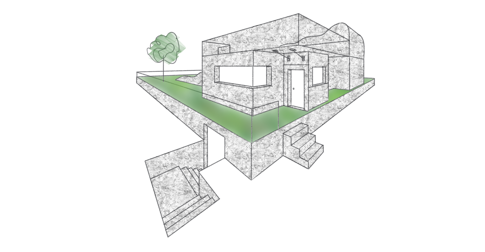

# Digitales Kunstheft

Übung: Ein Haus konstruiert: mit Einbuchtungen, Ausbuchtungen, einer Tür, Fenster, Treppe

.png)

Als zusätzliche Übung habe ich anschließend versucht, aus meiner Zeichnung, ein tatsächliches 3D-Modell zu konstruieren.

---