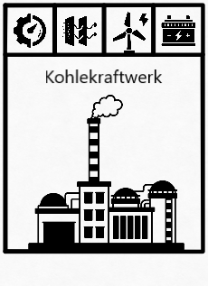

### Problemanalyse bzw. Themenfindung

Wenn darüber nachdenkt, gibt es ziemlich wenige Spiele, die sich mit dem Thema Klimawandel beschäftigen. Jedoch ein Spiel, das sich mit dem Klimawandel besonders detailliert beschäftigt ist Daybreak[^1]. Mit dieser Inspiration überlege ich eine Version zu entwickeln, die weniger kompliziert ist, aber dennoch den Klimawandel möglichst akkurat darstellt.

Problematisch ist das Ziel des Spiels und die Motivation, die meist durch ein kompetitives Spiel entsteht. Dementsprechend habe ich über weitere schon existierende Spiele nachgedacht, da ein Zusammenspiel gegen den Klimawandel, wo man entweder als Gesamtheit gewinnt oder verliert, meiner Meinung nach nicht optimal ist:

- Monopoly
- Mensch ärgere dich nicht
- Siedler von Catan
- Uno

Mir hat Monopoly und Catan besten gefallen, und letzlich habe ich mich dann für ein  Konzept zur Adaption von Monopoly entschieden, da ich dieses Spiel besser als Catan kenne und ich schon einige Ideen im Kopf hatte. Da es sich um eine Adaption von Monopoly handelt, werden die Spielmaterialien sich nicht stark abweichen. Die Spielfiguren werde ich höchstwahrscheinlich 3D drucken, um meine Spielfiguren akkurat darzustellen. Da es keine so kleinen Modell-Bäume gibt, werde ich diese auch drucken. Das Spielbrett wird aus den typischem pappartigen Material bestehen, und die Karten aus sehr dickem Papier. Eventuell kann man teile laminieren, um sie robuster zu machen.

### Ideenfindung und Illuminationsphase

#### Spielidee 1 (Daybreak, Risiko Adaption)

##### Aspekte und Maßnahmen

1. Klimakatastrophen
	Eventuell Ereigniskarten (wie bei Monopoly), die Klimakatastrophen auslösen. Anschließend müssen die Spieler darauf bezogene Maßnahmen ergreifen, um die Schäden bzw. Auswirkungen zu minimieren.
2. Umweltmaßnahmen
	- Erneuerbarer Energiequellen
	- Öffentlicher Verkehr
	- Umweltauflagen
	- Technologien (durch Forschung, siehe nächster Aspekt)
3. Forschung
	Spieler können in Forschung investieren, um innovative Lösungen für den Klimawandel zu entwickeln
4. Ressourcenmanagement
	Kluge Verwaltung von Ressourcen, um sicherzustellen, dass sie nachhaltig bewirtschaftet werden.
5. Ereignisse ab bestimmten Werten
	Beispielsweise könnten vermehrt Waldbrände eintreten, wenn die Temperatur der Welt einen bestimmten Wert überschritten hat.

Damit das Spiel Bildungselemente enthält, sollen auf den Ereigniskarten oder Aktionskarten kurze Texte und Fakten zur Erklärung stehen. Außerdem soll das Spiel die Kooperation zwischen den Spielern fördern, da es sich um ein Spiel handelt, in dem die Spieler zusammenarbeiten, um den Klimawandel zu bekämpfen. 

Jeder Spieler übernimmt die Rolle eines Umweltschützers und muss Maßnahmen ergreifen, um Treibhausgasemissionen zu reduzieren, erneuerbare Energiequellen zu fördern und die Umwelt zu schützen. Das Ziel ist es, die CO2-Emissionen zu verringern, bevor die globale Temperatur einen kritischen Punkt erreicht.

##### Ziel des Spiels

Ziel des Spiels ist es, die CO2-Emissionen zu minimieren bzw. 0 zu erreichen, bevor die globale Temperatur einen kritischen Punkt erreicht, oder die Bevölkerung zu unglücklich wird (vgl. SimCity BuildIt).

##### Vereinfachung

1. Ein einheitlicher CO2-Wert
	Es wird nicht zwischen CO2-Emissionen, dem CO2-Gehalt in der Atmosphäre und z.B. dem im Wasser unterschieden.
2. Symbolische Darstellung
	Anstatt detaillierter Berechnungen und komplizierter Begriffe, verwendet man Symbole auf den Spielsteinen. Die CO2-Emissionen könnte man mit einem Schieberegler darstellen, um an Quantität der Spielsteine zu sparen.
3. Eventkarten
	Mit Eventkarten steigt oder sinkt der CO2-Gehalt oder die Temperatur, je nachdem, ob sie Katastrophen oder Maßnahmen gegen den Klimawandel darstellen. 

#### Spielidee 2 (Monopoly Adaption)

- Anstatt von Ländern hat man Anlagen und Maßnahmen, die den Klimawandel bekämpfen sollen.
	- Diese sind ohne jegliches Upgrade erstmal schlecht für den Klimawandel (zum Beispiel Kohlekraftwerk anstatt Windkraftanlage), und somit erhöhen sich beim Kauf die Emissionen des Spielers
	- Mit jedem Upgrade verringert sich der Emissionshaushalt.
- Bäume anstatt von Häusern und Hotels (Upgrades der Grundstücke), mit denen man die Maßnahmen verschärfen, Anlagen verbessern oder Forschung betreiben kann.
- Jeder Spieler hat CO2 Emissionen. Das ist die einzige Währung - es gibt also kein Geld
- Man hat gewonnen, wenn man 0 Emissionen hat.
- Man darf eine bestimmte Grenze nicht überschreiten.
- Anstatt ins Gefängnis zu gehen, fährt/fliegt man in den Urlaub, da es sich dann negativ auf die Emissionen auswirkt.
- Ereigniskarten enthalten positive und negative Maßnahmen, die z.B. die Menge an Emissionen beeinflussen.
	- Klimakleber verhindern den Weg
- Wenn man auf ein Land kommt, kann man, solange es noch niemand anderes Besitzt, kaufen, indem man Emissionen aufnimmt.
- Wenn man auf ein Land kommt, welches schon jemand besitzt muss man CO2 Emission des Besitzers aufnehmen, die Gesamtzahl der Emissionen bleibt in diesem Fall also gleich, nur die Verteilung ändert sich.
- Oder man kann welche kaufen, indem wieder Emissionen aufnimmt, da bildlich gesehen, ein Baum aus dem Wald genommen wird, damit dieser als Upgrade verwendet werden kann. Der Baum stellt an dieser Stelle Ressourcen im Allgemeinen dar, und dass die Verwendung auch Auswirkungen auf die Umwelt haben.
- Wenn man über Start kommt, gibt man eine gewisse Menge an Emissionen ab. 
- Auf den Karten sollen zusätzlich kleine Infotexte stehen, um den Bildungsaspekt mit in das Spiel einzubringen.
- Es könnten u.a. folgende Spielfiguren geben:
	- Klimaaktivist
	- Wissenschaftler
	- Baum oder Blume (müsste sich von den anderen Bäumen unterscheiden)
	- Windkraftanalage
	- Eisbär (als betroffener des Klimawandels)
- In der Mitte könnte ein Wald sein, wo man alle Bäume hinstellt, die man als Upgrade verwenden kann. Damit kann man, wie bereits gesagt, Upgrades durchführen. Auf der anderen Seite sieht man bei der Verwendung der Bäume, dass der Wald kleiner wird, was allgemein die begrenzten Ressourcen darstellen soll.
- Man könnte Karten mit Zielen hinzufügen, die man auf bestimmten Feldern erhält, und mit denen man beim Erreichen der Ziele die CO2 Emissionen bei sich senkt.
- Wenn man zum Beispiel ein Kohlekraftwerk kauft, um es klimaneutral zu machen, muss man zunächst Emissionen aufnehmen, die die Nutzung des Kohlekraftwerks beschreibt. Wenn man Upgrades mit Bäumen hinzufügt, werden die Emissionen weniger, aber für den Nutzer teurer.

##### Felder

Beispiel eines Feldes:

Bei diesem Feld handelt es sich um ein Kohlekraftwerk, das nun nach und nach umweltneutral sein soll:
Das erste Upgrade (oben links) erhöht die Effizienz und den Wirkungsgrad des Kraftwerks, wodurch insgesamt weniger solcher Kraftwerke benötigt werden.
Das zweite Upgrade fügt Filter hinzu, die den CO2 Ausstoß verringern sollen.
Das dritte Upgrade ersetzt nach und nach die Kohlekraftwerke durch erneuerbare Energie (in diesem Fall Windkraftanlagen) 
Das vierte Feld speichert Energie, damit man nicht gebrauchte Energie aufbewahrt, und sie an Zeiten, wo beispielsweise kein Wind ist, nutzen kann.

weitere Felder:
- Gehe ins Gefängnis → Fliege in den Urlaub
- Rettung des Regenwaldes (der Regenwald wird durch Bäume pflanzen wieder aufgebaut)
- Verkehr (Upgrades: Car-Sharing, Ausbau der öffentlichen Transportmittel, nachhaltig bzw. umweltneutrale Fortbewegungsmittel, Optimierung der Stadtplanung, um allgemein Strecken zu reduzieren)
- Steuern zahlen → CO2-Steuer
- Eine „Straße”, also mehrere Felder mit der gleichen Farbe bilden zusammen einen Aspekt, wie man den Klimawandel bekämpfen kann (z.B. eine Straße, mit verschiedenen Nationalparks)
- Regierungsviertel, bei denen man Maßnahmen ergreifen kann, wie z.B. CO2-Steuer erhöhen

## Anhänge

Icons sind von: https://thenounproject.com/

[^1]: https://www.youtube.com/watch?time_continue=54&v=cmNS24bIXxw&embeds_referring_euri=https%3A%2F%2Fwww.langweiledich.net%2F