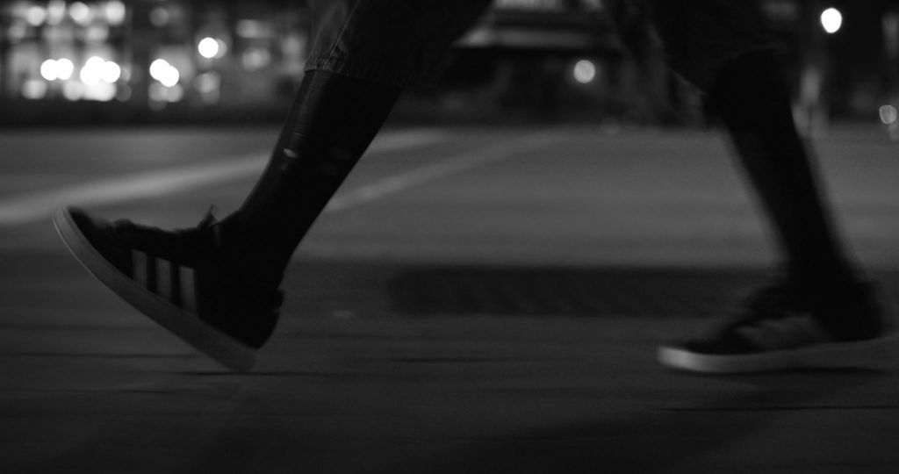
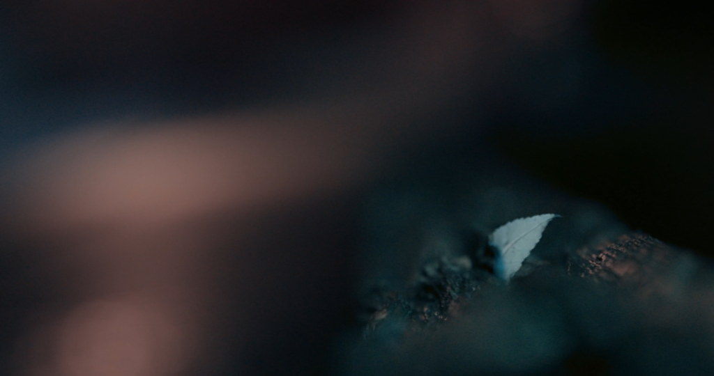

## Notizen

- **Belichtungszeit - Bewegung**
	- Was?
		- Bestimmt, wie lange Licht in die Kamera eintreten kann.
	- Wie?
		- Lange Belichtungszeit (bei geschlossener Blende) → Bewegung wird unscharf
		- Kurze Belichtungszeit (bei offener Blende) → „Einfrierung”, Bewegung ist scharf
	- Warum?
		- Kurze Belichtungszeit
			- Bild einfrieren
			- Um explodierende oder sich schnell bewegende Objekte scharf aufzunehmen
			- Momentaufnahme
		- Lange Belichtungszeit
			- Bewegungsunschärfe
			- Aufnahme einer Bewegung
			- Um eine dunkle, ruhige Umgebung aufzuhellen
			- Um bewegte Objekte verschwinden zu lassen (bei sehr langer Belichtungszeit)
- **Blende - Fokus**
	- Was?
		- Steuert, wie viel Licht in die Kamera gelangt
	- Wie?
		- Geschlossene/kleine Blende (bei längerer Belichtungszeit) → Höhere Tiefenschärfe
		- Offene/große Blende (bei kürzerer Belichtungszeit) → Höhere Tiefenunschärfe
	- Warum?
		- Hohe Tiefenunschärfe
			- Makroeffekt / Miniatureffekt
			- Fokus auf ein bestimmtes Bildelement
		- Geringe Tiefenunschärfe
			- Einfangen einer ganzen Szene
			- Um ein reales Abbild zu erzeugen
- **ISO - Empfindlichkeit**
	- Was?
		- Legt fest, wie lichtempfindlich die Kamera ist
		- Letztlich erhellt/verdunkelt es das Foto, nachdem es aufgenommen wurde
	- Wie?
		- Hoher ISO-Wert → Mehr Bildrauschen; Wird in dunklerer Umgebung benötigt
		- Niedriger ISO-Wert → Weniger Bildrauschen
	- Warum?
		- Um mehr Licht einzufangen
		- Mehr Bildrauschen
			- Es entsteht eine besondere Textur (z.B. um Flächen interessanter zu Gestalten)
			- Kann als Stilmittel verwendet werden
		- Weniger Bildrauschen
			- steril
			- künstlich
- **Belichtungskorrektur**
	- Was?
		- Bild wird dunkler
			- Weniger Details in den Schatten
			- Mehr in den Lichtern
		- Bild wird heller
			- Mehr Details in den Schatten
			- Weniger in den Lichtern
	- Warum?
		- Bild wird dunkler
			- Silhouetten

### Bewegung

### Fokus

 
 