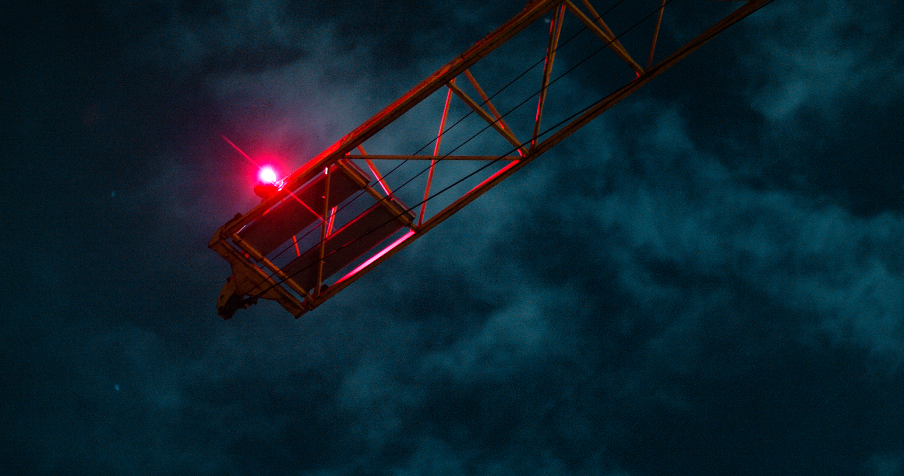

## Notizen

- **Untersicht**
	- Wie?
		- Kamera von unten nach oben ausrichten
		- Objekte von unten betrachten, um sie imposanter wirken zu lassen
		- Betonung auf Höhe und Größe legen
	-  Warum?
		- Dramatische und mächtige Darstellung
		- Verzerrung von Proportionen für kreative Effekte
- **Aufsicht**
	- Wie?
		- Kamera von oben nach unten ausrichten
	    - Objekte von oben betrachten, um sie zu verkleinern oder zu entmystifizieren
	    - Betonung auf Muster und Strukturen legen
	- Warum?
		- Verfremdung und Abstraktion
		- Neue Perspektiven und Interpretationen ermöglichen
- **Froschperspektive**
	- Wie?
		- Kamera nahe am Boden positionieren
	    - Objekte von unten und leicht schräg betrachten
	    - Betonung auf Dynamik und Bewegung legen
	- Warum?
		- Unkonventionelle und interessante Blickwinkel
		- Verstärkung von Dramatik und Spannung
- **Nahaufnahme**
	- Wie?
		- Nah an das Motiv herangehen
		- Details und Texturen erfassen
		- Betonung auf Intimität und Emotionen legen
	- Warum?
		- Intensive und persönliche Darstellung
		- Eintauchen in die Welt des Motivs

## Anhänge

### Untersicht

- Funktioniert sehr gut: trotz Reduzierung der Elemente hat das Bild eine starke Wirkung
- Dramatische Wirkung

### Froschperspektive

Das Bild mit der Brücke links und der Laterne hinten (siehe Video: When the shadows fall 2:31)
