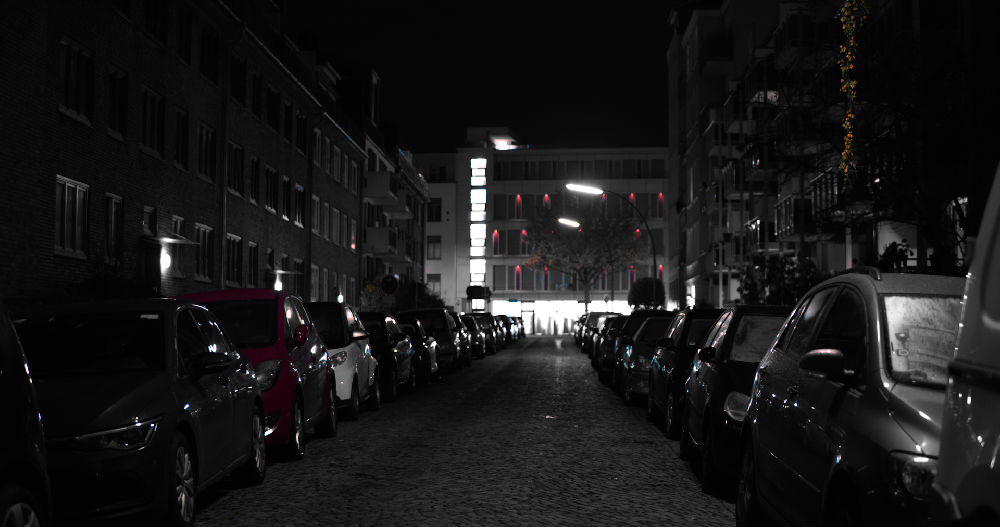
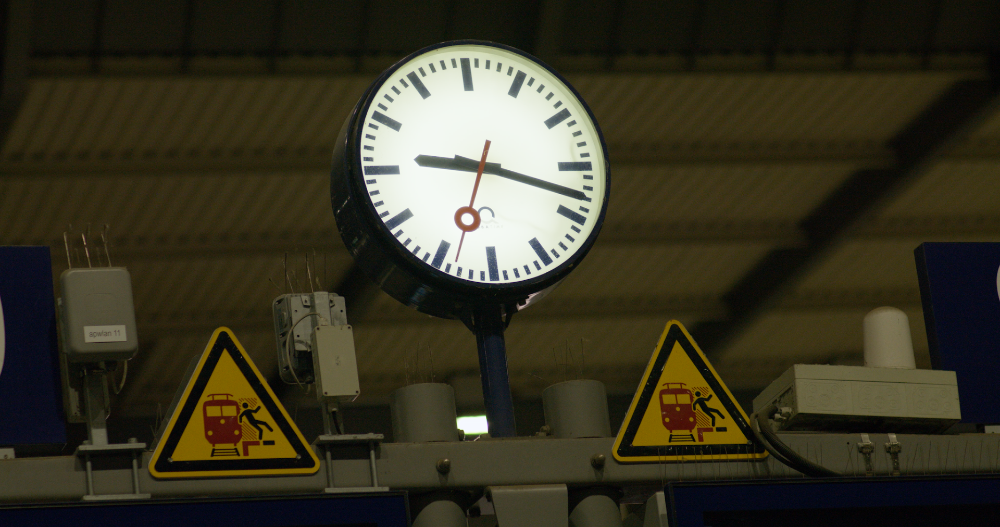
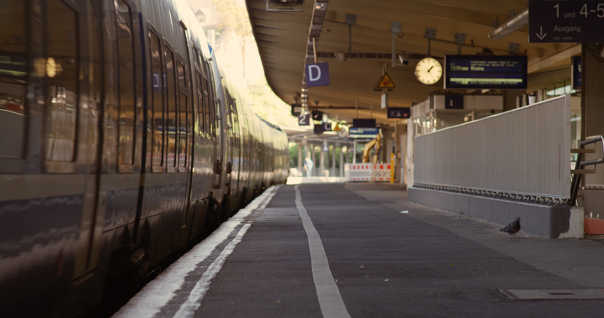

## Notizen

- **Bewusste Bildführung**
	- Wie?
		- Führungslinien suchen
		- Wirkung am stärksten, wenn sie vom Rand ins Bild verläuft
		- Dürfen prominent im Bild erscheinen
	- Warum?
		- Strukturierung der Komposition
		- Blick auf das Wesentliche lenken
- **Bildformat**
	- Wie?
		- Format an die dominanten Linien anpassen
		- Querformat → seitliche Bewegung
		- Hochformat → Bewegung nach unten und oben
	- Warum?
		- Klare Richtung geben
- **Drittelregel**
	- Wie?
		- Motiv auf den Linien platzieren, die das Bild horizontal/vertikal in Drittel teilen
		- Motiv dennoch nicht zu nah am Rand oder zwischen Mitte und Drittel
	- Warum?
		- Ausbalanciert, ohne dass das Motiv in der Mitte platziert sein muss
- **Symmetrie**
	- Wie?
		- Motiv mittig platzieren
		- Wenn alles perfekt symmetrisch ist, kann das Bild langweilig und leblos wirken
	- Warum?
		- Harmonie und Balance
		- Blicklenkung

### Symmetrie

- Stabiles Dreieck durch die Warnschilder und die Uhr
- Farbkontrast: Blau - Gelb
- Hell-Dunkel-Kontrast: Uhr - Hintergrund

### Blickführung

- Sich kreuzende Führungslinien machen das Bild interessanter
https://photos.app.goo.gl/D87mjoN42Eyv4hNb7