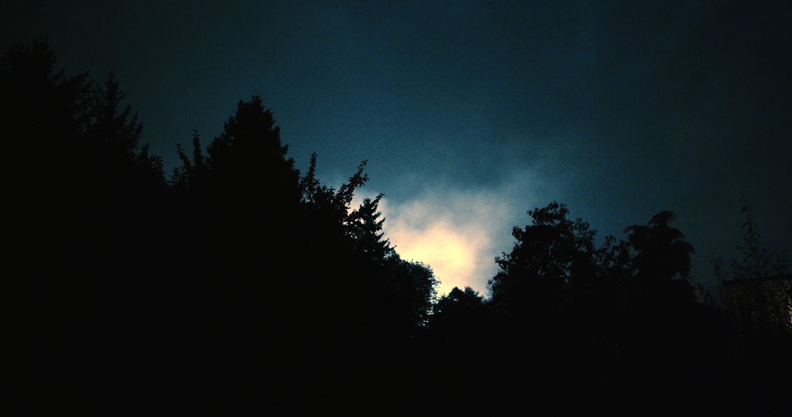
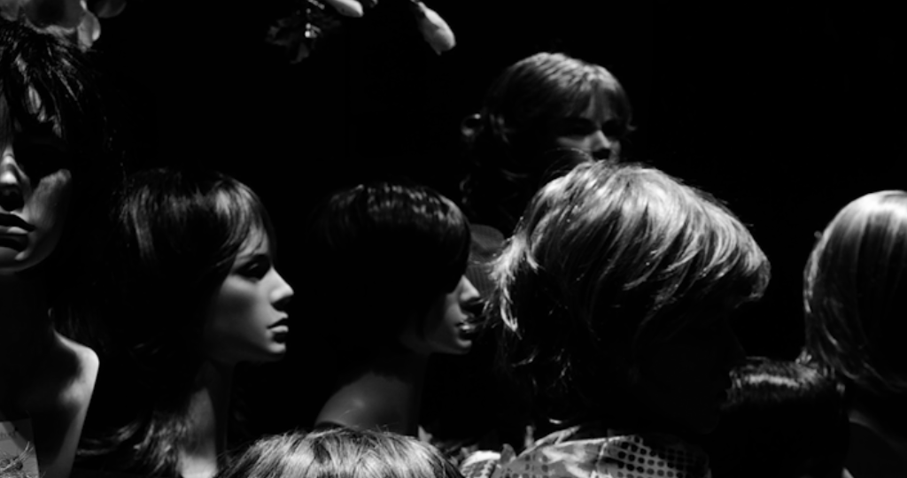
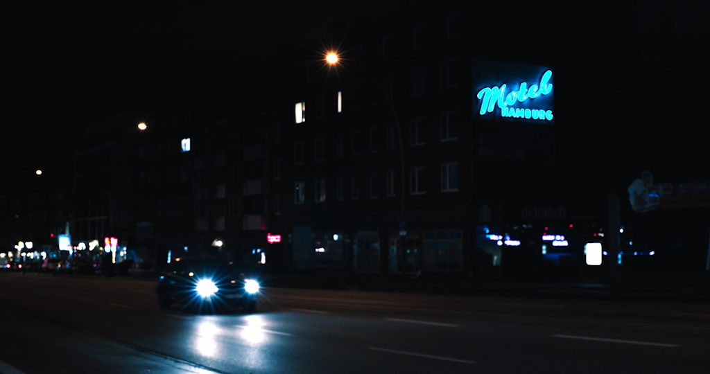

## Notizen

- **Silhouetten**
	- Wie?
		- Unterbelichtung → Schatten werden dunkler (bis zu einer schwarzen Fläche), mehr Details in den hellen Teilen des Bildes
		- Niedriger Blickwinkel, um mehr Himmel einzufangen (möglicher heller Hintergrund)
	- Warum?
		- Hoher Kontrast
		- Details in hellen Bildteilen
		- Unkenntlichkeit schaffen
		- Konzentration auf Formen
- **Kantenlicht**
	- Wie?
		- Silhouette vor dunklem Hintergrund
		- Abgrenzung wird durch ein Gegenlicht (z.B. Sonne) geschaffen
		- Wirkt Schwarz-Weiß am besten
		- Möglicherweise Absenkung der Belichtungskorrektur erforderlich
	- Warum?
		- Dramatische Wirkung
		- Unkenntlichkeit schaffen
		- Reduzierung
- **Schatten**
	- Wie?
		- Voraussetzung: hell / sonnig
		- Morgen- oder Abendsonne → lange Schatten → Schatten löst sich vom Motiv
		- Mittagssonne → starke Schatten auf dem Gesicht
		- Am besten bei hoher Schärfentiefe
	- Warum?
		- Unkenntlichkeit schaffen
- **Nachts auf der Straße**
	- Wie?
		- Nicht versuchen in der Nachbearbeitung Details aus den Tiefen wiederherzustellen
		- Künstliche Lichtquellen verwenden (Handy-Displays, Straßenlaternen, Ampeln, Autoscheinwerfer, Schaufenster)
	- Warum?
		- Hoher Kontrast
		- Stimmungsvolles Bild durch direkte Lichtquellen

### Silhouette

### Nachts auf der Straße

