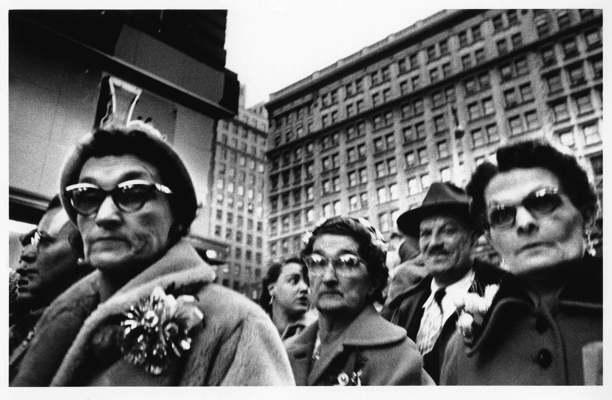

## Aufgabe

1. **Rekonstruktion**
	Wähle ein Foto aus. Zeichne die gesamte Komposition, Bildausschnitte oder interessierende Einzelgegenstände ab.
	- Gesichter der Personen mit digitalem Pinsel abgemalt
2. **Dekonstruktion**
	Rücke gestalterisch vom Foto ab und verfremde es (z.B. durch Collagieren, Umkopieren, Teilzerstören, digitale oder analoge Bildbearbeitung)
	- Kombinieren der abgemalten Teile
	- Filter
	- Einfärbung von Farbflächen (Himmel)
	- Kolorierung
	- Veränderung des Gesichtszugs (Frau vorne links), um sie weiter von den anderen Personen abzuheben
	- Verfremdung der Gesichter der restlichen Personen
3. **Konstruktion**
	Konstruiere neu! Nutze das Motiv oder die Gesamtkomposition des Ausgangsfotos als Anlass für eine neue und individuelle Bildschöpfung
	- Einbettung der Krone
	- Dekonstruktionselemente kombiniert

## Original

William Klein: Xmas Macys December (1954)

## Ergebnis

