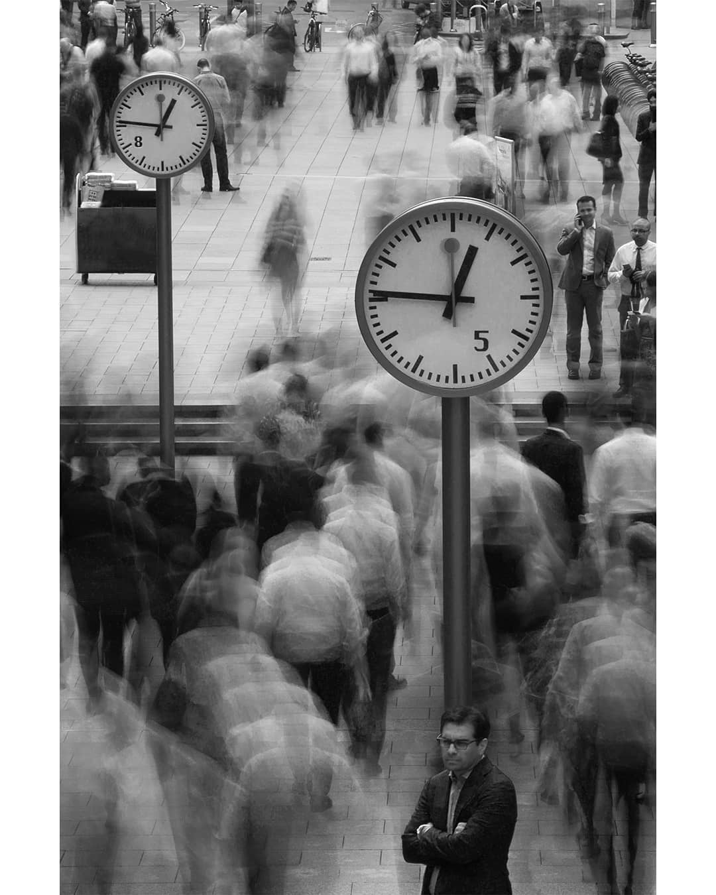

## Aufgabe

Gestalte eine Fotoserie zum Thema Anonymität.

## Problemanalyse bzw. Themenfindung

### Bildsammlung Streetphotography[^1]

#### Inwiefern wird hier das Thema Anonymität eingefangen?

**Bilddaten:**
Das Bild stammt von Juaco Carriquiry. Da Originalquelle nicht existiert und das Bild anderswo nicht auffindbar ist, sind dies die einzigen Informationen über das Bild.
Quelle: https://same.energy/i/oWxoY



- Menschliche Masse: Strom an unkenntlichen Personen und die große Anzahl an Personen ohne erkennbare Gesichter symbolisiert die Entpersonalisierung
- Verwendung von Langzeitbelichtung:
	- Bewegungsunschärfe führt dazu, dass die Gesichtszüge und individuellen Merkmale (z.B. Kleidung) unkenntlich werden.
	- Die wenigen scharf dargestellten Personen heben sich ab und verstärken bzw. betonen die Anonymität der anderen. Zudem sind die erkennbaren Personen fast alle allein.
- Menschliche Masse: Strom an unkenntlichen Personen und die große Anzahl an Personen ohne erkennbare Gesichter symbolisiert die Entpersonalisierung.
- Verwendung von Langzeitbelichtung: Die Bewegungsunschärfe führt dazu, dass die Gesichtszüge und individuelle Merkmale (z.B. Kleidung) unkenntlich werden.
- Schwarz-Weiß-Fotographie:
	- (Zeitlos → Anonymität lässt sich also auch bei der Entstehung des Bildes wiederfinden)
	- Monochrome Farbpalette gibt weniger Informationen preis, als ein größeres Farbspektrum
	- Betont die mit Anonymität einhergehende Stimmung von Einsamkeit
- Vertikale Linien: Die Pfeiler der Uhren trennen die Menschenmasse visuell, was das Gefühl von Isolation verstärkt.

#### Weitere Bilder

Schwarz-Weiß-Fotographien:
https://same.energy/i/oWxoY

https://www.dianewehr.com/blog/2021/3/4/anonymous-street-photography

Größtenteils mit Silhouetten und Schatten gearbeitet, um die Personen zu verfremden:
https://designyoutrust.com/2016/11/pawel-gulewicz-creates-anonymous-street-photography-which-asks-who-the-people-we-pass-by-every-day-really-are/

### Skizzen

#### Bild 1

- Anschnitt der Personen, um das Gesicht zu verdecken
- Masse an Menschen
	- Das Individuum liegt nicht mehr im Fokus
	- Jeder läuft für sich
- Dynamik durch die Bewegung der entgegenkommenden Menschen
- Spannung durch entgegengesetzte Bewegung
- Es entsteht ein Dreieck, welches sich tief ins Bild erstreckt
	- Das Dreieck entsteht durch die Personen und dem Boden
	- Sorgt für Stabilität
	- Blickführung „revealt” das Bild (von unten nach oben)
-  Die Spitze des Dreiecks zeigt auf eine Person, die allerdings so weit weg ist, das sie unkenntlich bleibt
- Alle Gesichter sind aufgrund leichter Tiefenunschärfe, Bewegungsunschärfe, Abscheidung oder einer Maske nicht erkennbar.
[](https://photos.google.com/share/AF1QipN0n9Kz9Cew6zH1yS065O_g4ooJ1rlWNxGhm9T-geTU7I55_8CyjcWxhDxKiwrwEg/photo/AF1QipNlWYugyFeDqJHrADu_zXPFuKXGq3DghkdEHyib?key=ampJU043ZGJmMkItalFtd29FUF9UTktpTnU3S1RR)


```photos
{"title":"Kunst Fotographien","query":{"albumId":"ALiOiDWAU-xZGXEo9sTffviJ4Ud_xD3fg0YB_Rs0L_PJ_GIwdOOuVt3R19N2MFzl1f2fqoMBuY9y"}}
```

#### Bild 2

- Menschen sind aufgrund der Reflexionen nicht erkennbar
- Masse an Menschen
	- Das Individuum liegt nicht mehr im Fokus
- Hektik im Hintergrund, Stabilität im Vordergrund durch vertikale und horizontale Linien

https://photos.google.com/share/AF1QipN0n9Kz9Cew6zH1yS065O_g4ooJ1rlWNxGhm9T-geTU7I55_8CyjcWxhDxKiwrwEg/photo/AF1QipNlL7BbquVbAjNMKdqa9ftwXGGCExWPi5cfS11c?key=ampJU043ZGJmMkItalFtd29FUF9UTktpTnU3S1RR

#### Bild 3

- Wenig Bildinformationen und Anonymität durch…
	- Bildausschnitt
		- Die Person ist von Fuß bis Kniehöhe begrenzt
		- Straßen erzeugen Farbflächen
	- Bewegungsunschärfe und Tiefenunschärfe
		- Geschäfte sind im Hintergrund nicht erkennbar
	- Farben
		- Schwarz-Weiß-Bild reduziert die Farben

https://photos.google.com/share/AF1QipN0n9Kz9Cew6zH1yS065O_g4ooJ1rlWNxGhm9T-geTU7I55_8CyjcWxhDxKiwrwEg/photo/AF1QipPjnfnjC2DEZU_EXnYpxPJUXsGnAn94TooZzhtH?key=ampJU043ZGJmMkItalFtd29FUF9UTktpTnU3S1RR

## Ideenfindung

### Thema

Bewegung, Mobilität → Jeder ist für sich und mit sich beschäftigt

## Anhänge

[^1]: https://ght-hh.taskcards.app/#/board/3d042a32-2d98-450b-aa97-77be7de6caa1?token=559814a6-6a34-43ac-87b9-9b4983d4b6bc