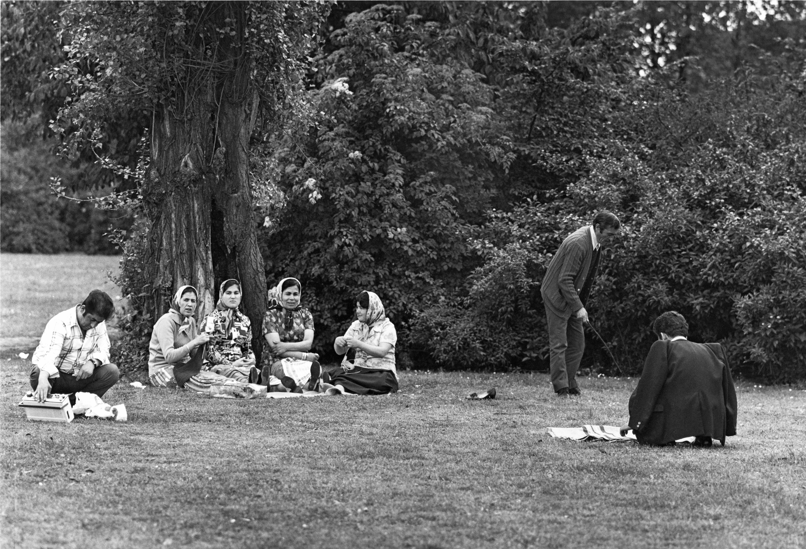
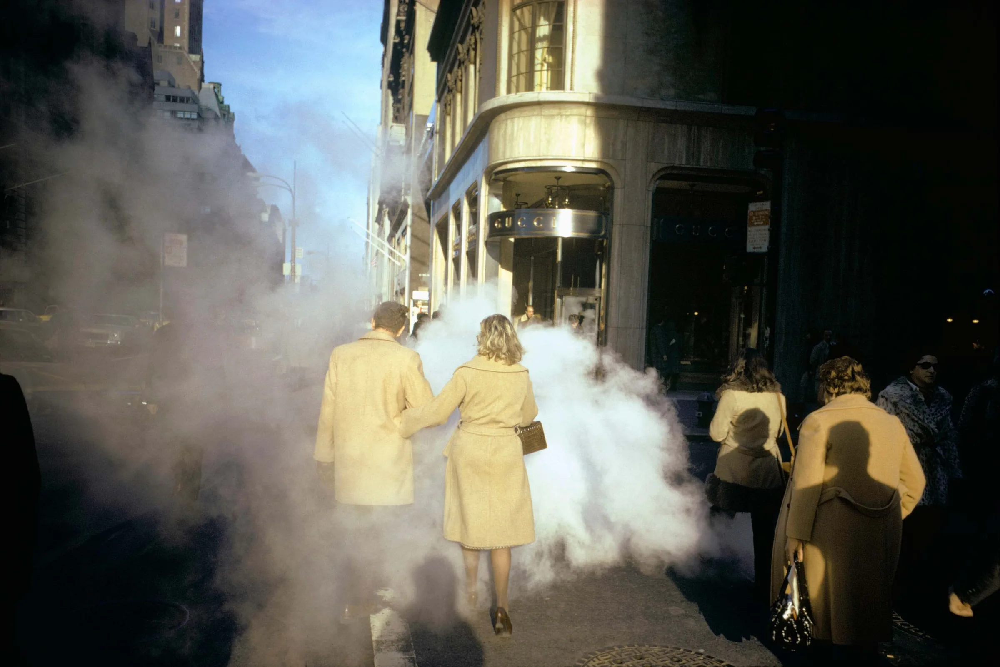

## Volksgarten Köln II (1974)

### Mit dem Bild konnotierte Begriffe

- Schwarzweiß
- Gleichförmigkeit
- Momentaufnahme
- Glück
- Konzentriert
- Natur
- Baum
- Ruhe
- Friedlich
- Entschleunigt
- Ausgeglichen
- Idylle
- Zusammensein, Zugehörigkeit
- Baum
- Knistern, Rauschen

### Fünf-Sinne-Check

Ich sehe einen Park und Menschen. Ich höre die Gespräche der Frauen und Musik aus dem Radio. Die Blätter rauschen im Wind. Ich rieche das Gras und die frische Luft. Ich schmecke nichts. Ich fühle mich gelassen und entspannt.

### Innerer Monolog

Während ich auf das Bild schaue, entsteht vor meinen Augen eine **lebendige** Szene. Die Sonne malt mit ihrem **warmen Schein** alles in einen goldenen Glanz, und die Atmosphäre ist erfüllt von **leichten Geräuschen der Natur**, gepaart mit fröhlichen Menschen. Die Vögel zwitschern, die Kinder lachen - eine Symphonie, passend für einen ausgelassenen **ruhigen** Tag im Park. Da sind vier Frauen in der Nähe, unter einem Baum sitzend, Schutz im Schatten seiner Krone suchend. Vertieft in ein lebhaftes Gespräch, gleichzeitig fleißig am Arbeiten ihrer Handarbeiten. Der Anblick vermittelt ein Gefühl der Kameradschaft, und ich kann mir beinahe das Lachen und die geteilten Geschichten vorstellen, die die warme Sommerluft um sie herum durchdringen. Unweit der Frauengruppe hockt ein Mann im Gras, scheinbar kämpfend mit den Feineinstellungen eines Radios. Sein konzentrierter Blick deutet auf eine Mischung aus Entschlossenheit und Frustration hin. Unbeirrt in seinem Vorhaben, den trägen Rhythmus des Sommertages durch die vertrauten Klänge eines Radios zu vervollständigen. Ein Moment der menschlichen Zähigkeit angesichts technologischer Launen. Nicht weit entfernt schlendert ein anderer Mann durch die Szene, vertieft in seine Tätigkeit, mit einem Stock im Boden herumstochernd. Der genaue Zweck seiner Erkundung ist unklar, vielleicht ein verspielter Versuch, mit der Welt um sich herum zu interagieren. Oder auch eine beinahe schon kindliche Neugier, die eine Prise Verspieltheit in die ruhige Szenerie bringt. Schließlich gibt es noch eine letzte Figur in der Nähe dieser kleinen Gruppierung. Ein Mann, wieder auf dem Boden hockend, vertieft in seine Aufgabe, eine Decke auszubreiten. Sein Gesicht ist nicht sichtbar, doch sein konzentriertes Auftreten vermittelt einen akribischen Ansatz zu einer vermeintlich simplen Tätigkeit. Sein Anblick ruft ein Gefühl von Bestimmtheit hervor, das Ziel, inmitten des bunten Mosaiks eines Parks in der Sommerzeit einen Ruhepol, einen Raum für Entspannung zu schaffen.

### Analyse

- Vertikale und horizontale Linien, keine Diagonalen → Stabilität
- Gleichmäßige Verteilung von hell und dunkel
- Die vier Frauen sind hervorgehoben, da sie die einzigen Personen sind, die in einem Hell-Dunkel-Kontrast zum Hintergrund stehen. → Befinden beim goldener Schnitt (x und y-Achse)
- Weniger Farben aufgrund von Schwarzweiß → ruhiger
- Wenig bis keine Bewegung der Elemente im Bild
- Wenig verschiedene Bildelemente
- Blätter und Wiese bilden Farbfläche haben wenig Tiefe
- Bruch der Diagonale durch den Mann mit dem Gehstock ist aufgehoben, da er im Hintergrund verschwindet (wenig Kontrast)
- Weiche Schatten → sanftes Erscheinungsbild
- Köpfe befinden sich auf der gleiche Höhe, die Hand des stehenden Mannes befindet sich auch auf dieser Linie. Da der Kopf des stehenden Mannes im geringen Kontrast zum Hintergrund steht, fällt es nicht so stark ins Gewicht, dass er nicht auf dieser Linie ist.
- Trennung links/rechts durch Kontrast in der Kleidung der Personen; Trennung oben/unten durch dunklen Hintergrund und hellen Vordergrund

## New York City (1975)

### Mit dem Bild konnotierte Begriffe

- Fliegen
- Nebelwolke
- Überforderung
- Trubel
- Laut
- Parfüm
- Ungewöhnlich
- Glück
- Gleichförmigkeit
- Anonymität
- Elegant
- Edel
- Glänzend
- Momentaufnahme
- Romantik
- Entgegengesetzt

### Analyse

- Hell-Dunkel-Kontrast
- Kalt-Warm-Kontrast
- Wenige Farben
- Komposition
	- Nebel bildet ein Dreieck
	- Die Personen auf der rechten Seite bilden auch ein Dreieck
	- Fluchtpunkt befindet sich auf dem Drittel (Drittelregel)
- Licht kommt von hinter dem Betrachter
	- traegt zur Dynamik bei (Schatten fallen in die Richtung des Fluchtpunkts)
- Es wirkt so, als waere noch mehr los, weil auf die Ruecken der Personen Schatten von anderen Personen fallen
- Dramatische Wirkung aufgrund vieler Kontraste
- Spannung durch unterschiedliche Positionen zwischen Fluchtpunkt und Treffpunkt der Dreiecke
- Bruch zwischen der Richtung des Fluchtpunkts und dem Nebel/Rauch von rechts

### Ausformulierte Analyse & Deutung

#### Analyse

Die Fotographie „New York City“ ist von Joel Meyerowitz aufgenommen  
worden und entstand im Jahr 1975. Auf ihr ist eine New Yorker Straße 
abgebildet. Es ist ein heller Tag, weswegen im Hintergrund ein blauer 
Himmel zu sehen ist. Im Vordergrund sind Spaziergänger zu sehen, die 
zwischen den Häusern entlang der Straße laufen. Im Fokus steht dabei ein 
vermutliches Paar, dass in ähnlichen Mänteln eingekleidet ist und durch 
eine Rauchwolke läuft. Anders als die anderen Menschen werden sie nicht 
von den Häuserwänden beschattet, die Sonne beleuchtet sie. 

Im Rahmen der Komposition ist zunächst festzuhalten, dass die 
Personenkonstellation nicht ausgeglichen ist. Durch die Entfernung des 
Paares entsteht eine Distanz zu den restlichen Menschen auf der Straße, 
die sich auf der rechten Seite des Bildes gruppieren. Durch diese 
asymmetrische Aufteilung, hebt sich das abgegrenzte Paar von der Menge 
hervor und rückt so in den Fokus des Bildes. Sie sehen ebenfalls in 
vertikalen Achsen parallel zu den Häuserwänden und verleihen dem Bild 
so eine gewisse Struktur. Die Rauchschwaden lassen die Fotografie da-
gegen etwas belebter wirken, denn sie sind nicht formbegrenzt  markieren 
so erkenntliche Bewegung im Bild, die es weniger einheitlich sondern eher
etwas chaotischer wirken lassen und das typische Bild des Straßentreibens 
unterstreichen.

Im Gegensatz dazu sorgt der Lichteinfall für Spannung im Bild, die zu vor 
angesprochene 
 statische Wirkung wird durch diesen aufgebrochen. Dies entsteht 
unterandrem durch den Helldunkel Kontrast, der durch den Tageslicht-
einfall und das Schattenwerfen der Häuserwände hervorgerufen wird. 
Durch die besondere Beleuchtung des Paares wirkt es für den Betrachter 
so, als würde das Paar besonders hervorgehoben werden und die beiden 
Personen sind so Hauptakteure des Bildes. 

Die intensive und eindrucksvolle Erstwirkung wird außerdem durch die
 Farbwirkung des Bildes erklärlich. Der Hellblaue Himmel wirkt besonders 
strahlend da er einen Komplimentär-Kontrast zu den beigen 
Häuserwänden bildet und vom einheitlichen Farbschema des Bildes 
abweicht. 

Im Generellen kann so festgehalten werden, dass durch Komposition,
Lichteinfall und Farbgebung das aufgenommene Straßentreiben des 
Fotografen eindrucksvoll jedoch auch dynamisch und chaotisch wirken 
lässt. 

#### Bilddeutung

Die dynamische und chaotische Wirkung kann auf den 
form unbegrenzten Rauch und das rege Straßenleben, das 
abgebildet ist, zurückgeführt werden, sowie die verschiedenen 
Spannungsvollen Kontraste in Form und Farbe.
Eindruck entsteht durch das Gesamtspiel der verschiedenen 
kompositorischen Mittel, aber besonders durch die Statischen 
hochgebauten Häuser, die den großstädtischen Anschein betonen.
Bezieht man jene werkimmanenten Eindrücke jetzt auf den Kontext des 
Bilds, kommt man zu einer größeren Erkenntnis. Das Stadtleben wird 
widergespiegelt und die Menschlichen Individuen innerhalb der Stadt, die 
mit unterschiedlichen Zielen die Straße passieren und im Kontext der 
Großstadt anonym und unerkannt bleiben. Eine Faszination für die 
Großstadt wird deutlich. Menschen in der Großstadt sind bewegungsfrei 
und flexibel - dynamisch.

## Vergleich

| Volksgarten Koelln II | New York City |
| ---- | ---- |
| Schwarz-Weiss | Farbe, warm und kalt, vor allem Beige und Grau/Blau |
| Statisch, ruhig | Dynamisch, Brueche |
| Nur Vertikalen und Horizontalen | Viele Diagonalen |
| Weiche Schatten | Harte Schatten |
| Wenig Tiefe | Viel Tiefe |

## Anhänge

[[../../Daily Notes/11.01.24|11.01.24 - Monolog]]