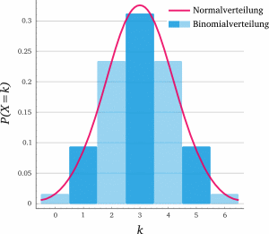

>**Merke**:
>Wahrscheinlichkeitsfunktion zur Bestimmung der Wahrscheinlichkeit eines ganz konkreten Ergebnisses.
>(Diskrete) Verteilungsfunktion zur Bestimmung der Wahrscheinlichkeit in einem Intervall/Abschnitt.

## Bernoulli

### Bernoulli-Versuch

Ein Bernoulli-Versuch ist ein Zufallsversuch, bei dem man sich nur dafür interessiert, ob ein bestimmtes Ereignis (Treffer) eintritt oder nicht.

### Bernoulli-Kette (T. S. 48)

Eine Bernoulli-Kette ist eine Serie unabhängiger Bernoulli-Versuche. Die Treffer-Wahrscheinlichkeit ist bei jedem Bernoulli-Versuch gleich.

### Wahrscheinlichkeitsfunktion

Um die Wahrscheinlichkeit für **genau $k$ Treffer** zu berechnen:
$$
P(X=k) = {n \choose k}\cdot p^k \cdot (1-p)^{n-k}
$$
$p$ ist die Wahrscheinlichkeit für einen Treffer eines Bernoulli-Versuchs.
$k$ ist die gewünschte Anzahl an Treffer.
$n$ ist die Anzahl der Versuche.

Der erste Faktor $n\choose k$ beschreibt die Anzahl der Pfade bzw. Kombinationen. Der zweite Faktor beschreibt die Wahrscheinlichkeit für die Treffer in der Kombination und der dritte Faktor bezeichnet die Gegenwahrscheinlichkeit, also kein Treffer.

Um die Wahrscheinlichkeit für eine Mindestzahl an Versuchen zu berechnen, muss man alle Einzelwahrscheinlichkeiten addieren, oder die Einzelgegenwahrscheinlichkeiten von 1 abziehen (siehe [[#Diskrete Verteilungsfunktion]]).

#### Beispiel

Wie ist die Wahrscheinlichkeit bei **10 Würfen** genau **3 mal** eine 6 zu würfeln.

$p$ ist $\frac{1}{6}$, was der Einzelwahrscheinlichkeit eine 6 zu würfeln entspricht.
$k$ ist $3$.
$n$ ist $10$.

Setzt man nun die Werte in die Formel ein, kommt man auf:
$$
P(X=3) = {10 \choose 3}\cdot (\frac{1}{6})^3 \cdot (1-\frac{1}{6})^{10-3} = 0.155
$$

### Diskrete Verteilungsfunktion

Die diskrete Verteilungsfunktion ist eine [[Verteilungsfunktionen|Verteilungsfunktion]], um die Wahrscheinlichkeit für alle diskreten $X$ mit der Bedingung $(X \leq x)$:
$$
F_p(x) = \sum_{i=0}^{x}{{n\choose i} \cdot p^i \cdot (1-p)^{n-i}}
$$
$x$ die rechte Grenze des Integrals.
$p$ ist die Wahrscheinlichkeit eines [[#Bernoulli-Versuch|Bernoulli-Versuchs]].

#### Beispiel

Wie ist die Wahrscheinlichkeit bei **10 Würfen** mindestens **2 mal** eine 6 zu würfeln?

$p$ ist $\frac{1}{6}$.
$k$ ist $\geq 2$.
$n$ ist $10$.

Setzt man nun die Werte in die Formel ein, kommt man auf:
$$
P(X \leq 2) = 1 - \sum_{i=0}^{2 - 1}{{10 \choose i} \cdot (\frac{1}{6})^i \cdot (1 - \frac{1}{6})^{10-i}} = 0.485
$$

## Binomial-Verteilung

Die Binomial-Verteilung ist eine diskrete [[Verteilungsfunktionen#Wahrscheinlichkeitsverteilung|Wahrscheinlichkeitsverteilung]], d.h. es gibt eine endliche Anzahl an Werte für $x$. Sie beschreibt die Anzahl der Erfolge einer [[#Bernoulli-Kette (T. S. 48)|Bernoulli-Kette]].

**Erwartungswert**: $E(X) = n \cdot p$
**Varianz**: $V(X) = E(X) \cdot ( 1 - p )$
**Standardabweichung**: $\sigma(X) = \sqrt{V(X)}$