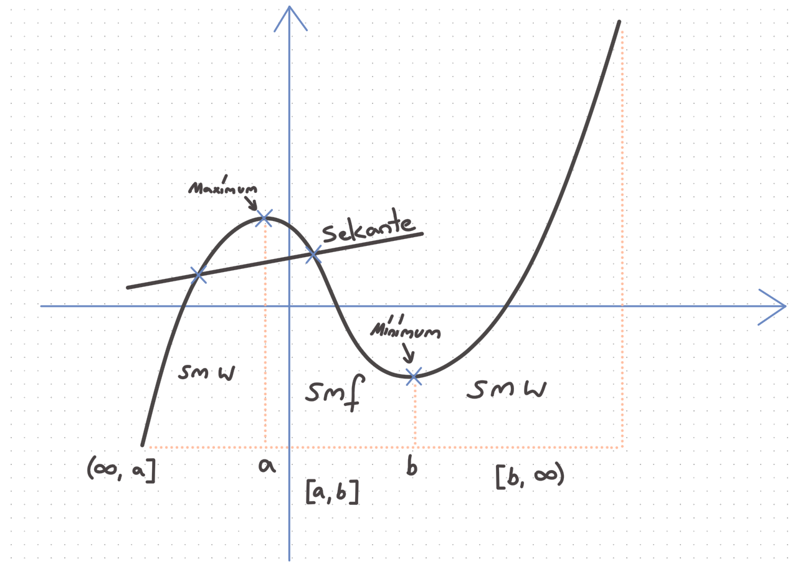
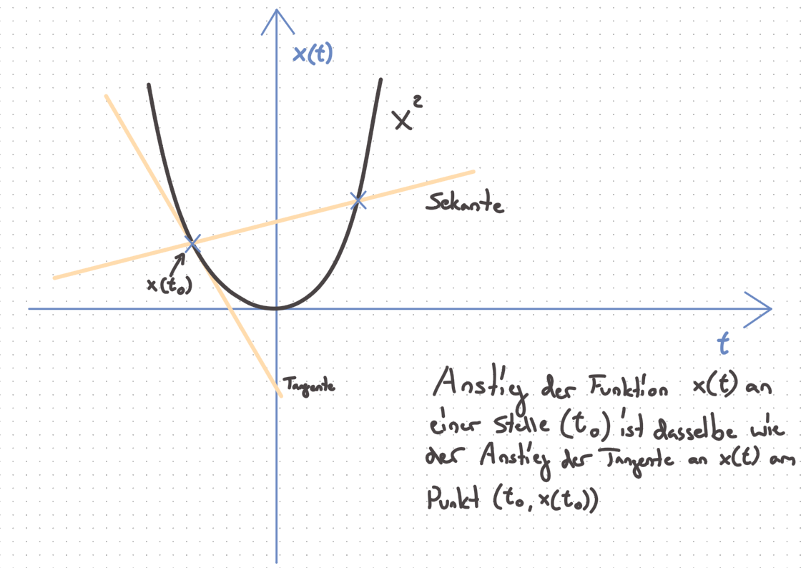
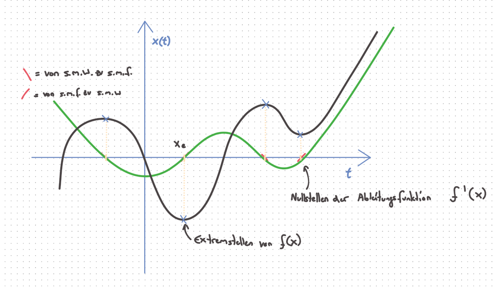

# Differentialrechnung

ℝ = Reelle Zahlen
x∈ℝ = x ist eine Reelle Zahl
s.m.w. = streng monoton wachsend
s.m.f. = streng monoton fallend

Intervall:
x∈ℝ, x∈ [0, 1]
Alle Zahlen zwischen 0 und 1. Geschlossenes Intervall
Umgedrehtes A bedeutet (∀): für alle
x∈(0, 1)
Alle Zahlen < 1 und > 0. Offenes Intervall
Sei f(x) eine Funktion
*a*, *b* ∈ ℝ; *a* < *b*; *x* ∈ [*a*, *b*]
dann heißt f(x) auf [a, b] streng
monoton wachsend, genau dann wenn (g.d.w.)
∀*x*1, 2 ∈ [*a*, *b*] *und* *x*1 < *x*2
*f*(*x*1) < *f*(*x*2)

Sei f(x) eine Funktion auf ℝ
dann heißt a∈ℝ ein Maximum von f(x)

> b∈ℝ ein Minimum von f(x)
> 

g.d.w. x<a f(x) s.m.w.
x>a f(x) s.m.f.
x<b s.m.f.
x>b s.m.b

An Extremstellen (und nur da) ändert sich das Monotonieverhalten!
Was ist eine Nullstelle?
0 = *f*(*x*)
g.d.w.
Sei f(x) eine Funktion auf ℝ
dann heißt *x*0 ∈ ℝ NS von f(x)
g.d.w. f(*x*0) = 0

| Zeichen | Bezeichnung | Beispiel | Gegenbeispiel |
| --- | --- | --- | --- |
| ℕ | natürliche Zahlen | 1; 5 | -1; Pi; $\frac{1}{3}$ |
| ℤ | ganze Zahlen | -1; 4 | 1,5; ; $- \frac{1}{3}$ |
| ℚ | rationale Zahlen | $\frac{1}{3}$ | Pi; ± |
| ℝ | reelle Zahlen | 1; Pi; ; $- \frac{1}{3}$ | i ( ) |

Definitionsbereich und Wertebereich einer Funktion:
$f(x)\  = \ \frac{1}{x}$
Definitionsbereich = *x* ∈ ℝ  ∩  x ≠ 0
Wertebereich = *f*(*X*) ∈ ℝ ∩ *f*(*X*)≠ 0
∩ = *und*; ∪ = *oder*
Definitionsbereich = Alle Werte, die X sein dürfen
Wertebereich = Alle Werte, die bei f(x) herauskommen.
Eine Funktion heißt **stetig** g.d.w. sie mit **einem** Strich gezeichnet werden kann, ohne abzusetzen. Beispiel: x²; Gegenbeispiel: 1/x

Sekantenanstieg:
Betrachte *s*(*t*) = 2*t*² + 4*t*

- skizziere die Funktion - Check
- Bestimme die Durchschnittsgeschw.

Intervalle:
zw. t∈[0, 1] = Ø 6 s/t
t∈[-1, 3] = Ø 8 s/t
t∈[0, 2] = Ø 8 s/t
Durschnittsgeschw. (Ø) = $\frac{y_{2} - y_{1}}{x_{2} - x_{1}}$ bzw. $\frac{\text{Δy}}{\text{Δx}}$
Durchschnittliche / Mittlere Geschwindigkeit zwischen Punkten ⇔
Anstieg der Gerade, die durch die 2 Punkte führt!
Die Gerade schneidet die Funktion in 2 Punkten. Analog zum Kreis heißt die Gerade dann (auch) Sekante. Wir haben also den **Sekantenanstieg** berechnet!!

- mittlere Änderungsrate
- durchschnittliche Änderungsrate

Beispiel 2:
$f(x) = \frac{1}{2}x^{4} + 3x - 2$
x∈[0, 1] =
x∈[-2, 2] =
x∈[-1/4, 4] = $y1 = - \frac{1407}{512}\ y2 = 138$ == 31,824
= -0,3849602
Beispiel 3:
*f*(*x*) = 10*x*² + 3
*g*(*x*) = log10(*x*)

| X0 | Y1 | Anstieg f(x) | Anstieg g(x) |
| --- | --- | --- | --- |
| 1 | 2 | 30 | 0.301 |
| 1 | $\frac{3}{2}$ | 25 | 0.352 |
| 1 | $\frac{1001}{1000}$ | 20.01 | 0.434 |
| 2 | 3 | 50 | 0.176 |
| 2 | 2.5 | 45 | 0.194 |
| 2 | 2.01 | 40.1 | 0.217 |
| 1 | 0.99 | 19.9 | 0.436 |

Von der durchschnittlichen zur momentanen Änderungsrate - Die Anstiegsfunktion
Anstieg einer Funktion an einer Stelle (ein Punkt):

Funktionen, bei denen man die Tangente nicht eindeutig bestimmen kann, heißen (an diesen Stellen) nicht differenzierbar.
An der Stelle p(0|0) der Funktion f(x)=|x| ist sie nicht differenzierbar.
**Anstiegsfunktion:**
Anstiege an allen x-Stellen:
x → Anstieg von f (x)
f ’ (x) 1. Ableitung von f(x),
beschreibt den Anstieg von f (x) bei allen x∈ⅅ⊂ℝ

Ableitung = lokaler Anstieg = Tangentensteigung = momentane Änderungsrate
s (t) ’ = v (t)
s ’’ (t) = v(t)’ = a (t)
Zum Zusammenhang zwischen f(x) und f ‘ (x):
f ‘ (x) beschreibt den Anstieg der Funktion f(x) (Tangentenanstieg = 1 Punkt, wo der Anstieg berechnet wird).
Extremstellen von f(x) sind Nullstellen von f ‘ (x).
f ‘ (XE) = 0 (XE = Extremstelle)
Skizziere die Ableitung zu:
f(x) = (x+3)*(x-4)*x
g(x) = sin(x)
h(x) = sin(x)/x
sei f ‘ (x) = 2x skizziere f(x)
g ‘ (x) = -2x² skizziere g(x)
sin(x) ‘ = cos(x)
Wie berechnet man die Änderungsrate?
*x*1 − *x*0 = *h
x*1 = *x*0 + *h
f*(*x*) = *f*(*x*0 + *h*) − *f*(*x*0)
$m = \frac{f(x_{0} + h) - f(x_{0})}{h}$o
Grenzwertprozess:
limes h->0 Sekantenanstieg = Tangentenanstieg
$m = \frac{f(x_{0} + h) - f(x_{0})}{h}$
*limes* *h* −  > 0

1. Schreibe die Funktionswerte für x0 und x0+h
2. vereinfache
3. “setze” h=0
4. Das Ergebnis ist der Tangentenanstieg bei X0

Beispiel:
*f*(*x*) = *x*² *x*0 = 2
gesucht: *f* ′ (*x*0)
1.
$\frac{\text{limes}}{h - > 0}\ \frac{f(x_{0} + h) - f(x_{0})}{h}$
einsetzen:
$\frac{\text{limes}}{h - > 0}\ \frac{f(2 + h) - f(2)}{h}$
$\frac{\text{limes}}{h - > 0}\ \frac{(2 + h)² - 2²}{h}$
2. umformen:
$\frac{\text{limes}}{h - > 0}\ \frac{4 + 4h + h² - 4}{h} = \frac{4h + h²}{h}$
$= \frac{4h + h²}{h}\ |/h$
$\frac{\text{limes}}{h - > 0}\ 4 + h = 4$
*f*(*x*) = 4 + 2*x* * *x*3
Ableitungsfunktionen bestimmen ohne lim h→0 Methode:

1. Regel:

> Von f (x) = x² ist die Ableitungsfunktion: f ‘ (x) = 2x
> 
1. Regel:

> Von f (x) = xn ist die Ableitungsfunktion: f ‘ (x) = n*xn-1
> 

HIER:

*f*(*x*) = *sin*(*x*2)

*f*′(*x*) = *cos*(*x*2) * 2*x*

$f(x) = \frac{x}{x^{2} - 1} = x*{(x - 1)}^{- 2}$

*f*(*x*) =  − 2(*x* − 1) − 3

$\frac{n}{x^{e}} = n*x^{- e}$

$\frac{n}{x^{e}} = nx^{- e}$

[https://www.youtube.com/watch?v=fK9SRATRbDQ](https://www.youtube.com/watch?v=fK9SRATRbDQ)

KETTENREGEL:

*f*(*x*) = *u*(*v*(*x*))

*f*′(*x*) = *u*′(*v*(*x*)) * *v*′(*x*)

Ganzrationale Funktionen / Polynome:

| Funktionstyp | f(x) | f ‘ (x) |
| --- | --- | --- |
| Konstante | f(x)=a oder z.B. f(x)=42 | f ‘ (x) = 0*a*x0-1= 0 |
| lineare Funktion | f(x)=mx+b | f ‘ (x) = m |
| Polynom | f(x)=xn oder z.B. f(x)=x4 | n*xn-1 |

| Summe: | f (x) = u (x) + v (x)
f (x) = 5 + x7 | f ‘ (x) = u ‘ (x) + v ' (x)
f ‘ (x) = 0 + 7 * x7-1 |
| --- | --- | --- |
| Produkt: | f (x) = 𝛼 * u (x)
f (x) = 3 * x² | f (x) = 𝛼 * u ‘ (x)
f ‘ (x) = 3*2x1 = 6x |

Konstante Faktoren bleiben erhalten. Konstanten in einer Summe verschwinden. Die Ableitung der Summe ist die Summe der Ableitungen der Einzelfunktionen.

$s(t) = \frac{1}{2}*10*t² + 3t + 1$

*s* ′ (*t*) = 10*t* + 3

$f(x) = \frac{1}{2}(x + 1)(x - 2)$

$f(x) = \frac{1}{2}2x - \frac{1}{2}$

Der Punkt einer Funktion, bei dem sich das Krümmungsverhalten ändert, heißt Wendepunkt.

Das Krümmungsverhalten ist entweder rechts oder links gekrümmt. Links gekrümmt, wenn sich die funktion auf dem Graphen von -x nach +x nach links dreht, dann ist die links gekrümmt.

1. Parabel, Konstante
2. x³ und x5
3. sin(x) mit dem Intervall [-4, 2]

| Grad
(maximaler Exponent) | EP
(Extrempunkt) | WP
(Wendepunkt) | NS (Nullstelle, maximal möglich) |
| --- | --- | --- | --- |
| 0 | 0 | 0 | 0 |
| 1 | 0 | 0 | 1 |
| 2 | 1 | 0 | 2 |
| 3 | 2 | 1 | 3 |
| n | n-1 | n-2 | n |

$\sqrt[n]{x^{e}} = x^{\frac{e}{n}}$

*ab* * *ac* = *ab* + *c*

$\frac{n}{x^{e}} = nx^{- e}$

*f*(*x*) = *u*(*v*(*x*))

*f*′(*x*) = *u*′(*v*(*x*)) * *v*′(*x*)

*f*(*x*) = 3*x* + (2*x* + *x*2)10

*f*′(*x*) = 3 + 10 * (2*x* + *x*2)9 * (2 + 2*x*)