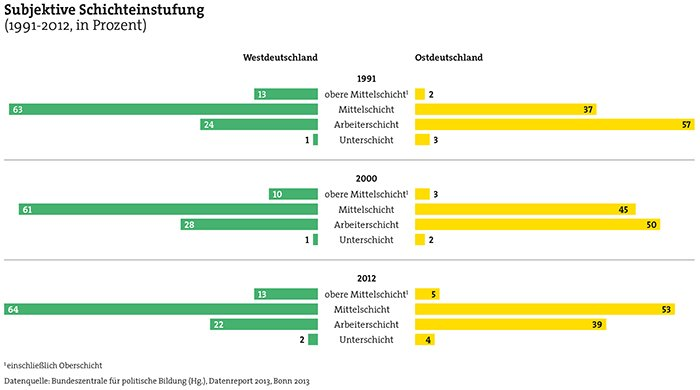

# Facetten Der Modernen Sozialstruktur

## Inhalt

- Soziale Schichten und Klassen
    - Klassenanalysen
- Schichtmodelle
    - Schichtmodell
    - Hausmodell
    - Vier-Schichten-Modell
- Soziale Lagen
- Soziale Milieus
    - Sinus-Milieus für Deutschland
    - Sinus-Lebenswelten u18
- Exklusion und Inklusion

## Soziale Schichten Und Klassen

Die Sozialen Schichten und Klassen fassen Menschen in eine Gruppe (Schicht oder Klasse) zusammen, die sich in einer ähnlichen sozioökonomischen Lage befinden. Mit den Lagen sind aufgrund ähnlicher Lebenserfahrungen ähnliche Persönlichkeitsmerkmale verbunden:

- sozioökonomische Lage
- Einstellung
- Wertorientierung
- Bedürfnisse
- Interessen
- Mentalitäten

### Klassenanalysen

Klassenanalysen sind meist durch vier Merkmale gekennzeichnet

- eine starke ökonomische Orientierung an den Markt- und Erwerbschancen
- die Analyse von Konflikten und Machtbeziehungen zwischen den Klassen
- die historische Orientierung und Entwicklung
- durch die theoretische Orientierung: Klassenanalysen beschreiben nicht nur, sondern analysieren die Ursachen von Ungleichheiten, Konflikten, Machtbeziehungen und Entwicklungen.

## Schichtmodelle

### Schichtmodell

Das Schichtmodell teilt die Gesellschaft in die Unterschicht, Mittelschicht und Oberschicht ein. Die Mittelschicht wird dabei nochmal in 3 weitere Schichten eingeteilt: die obere, mittlere und untere Mittelschicht. Das Hauptkriterium für das Schichtmodell sind das Einkommen und die Vermögenseinkünfte.

### Hausmodell

Ralf Dahrendorf wies auf, dass es soziale Mobilität zwischen den Schichten gibt, die aber mit Barrieren verbunden sind. Er bildete das “Hausmodell”, welches er in sieben Klassen und Schichten unterschied.

Hausmodell von Ralf Dahrendorf

- Infotext
    
    An der Spitze stehen wie immer die Eliten. Im Obergeschoss residieren nebeneinander die bürokratischen Helfer der Eliten, die Dienstklasse, "insbesondere nicht technische Verwaltungsangestellte aller Ränge", sowie der "alte Mittelstand" der Selbstständigen. Im Hauptgeschoss wohnen die große Arbeiterschicht und der "falsche Mittelstand" der einfachen Dienstleistungsberufe. Dessen soziale Stellung unterscheidet sich nicht von derjenigen der Arbeiter, er zählt sich jedoch seinem Selbstverständnis nach "fälschlicherweise" zur Mittelschicht. Die Arbeiterelite (hier Meister und Vorarbeiter) hat sich dagegen nach oben hin vom Rest der Arbeiterschaft abgesetzt. Der Keller des Hauses ist bevölkert von der Unterschicht der "Dauererwerbslosen, Unsteten, Rückfallkriminellen, Halbanalphabeten u. a.", die mitunter auch als "Bodensatz der Gesellschaft", "sozial Verachtete" oder "Lumpenproletariat" bezeichnet wurden.
    

Ein modernisiertes Hausmodell für die soziale Schichtung der Bevölkerung Deutschlands im Jahr 2009 orientiert sich an dem von Dahrendorf erkannten Grundmuster, zieht jedoch einige weitere Differenzierungslinien ein und macht die massiven Umschichtungen im vergangenem halben Jahrhundert deutlich. 7. Auflage von Rainer Geißler

### Vier-Schichten-Modell

Ein einfaches Vier-Schichten-Modell, das lediglich die subjektive Schichteinstufung als Kriterium heranzieht, macht erhebliche stabile Ost-West-Unterschiede deutlich.

West- und Ost-Deutschland haben sich nicht in den geplanten 5 Jahren und auch nicht in den inzwischen 30 Jahren ausgeglichen. Spitzenjobs sind in Wirtschaft, Politik, Medien, Gerichten und Universitäten in West-Deutschland deutlich häufiger vorhanden. Das Vertrauen nimmt allgemein ab. 2020 waren 54 Prozent mit der politischen Situation zufrieden. 2022 sind es nur noch 44 Prozent. Die Zufriedenheit ist im Westen mit 59 Prozent allerdings im Vergleich zum Osten 20 Prozent größer. Die Schere geht aber nicht weiter auseinander, sondern geht allgemein in den letzten Jahren zurück. Außerdem ist die Arbeitslosenquote im Osten höher als im Westen. 6,7 und 4,5 Prozent. Auch das Rentenniveau ist im Osten deutlich niedriger. Deutliche Unterschiede zeigen sich auch bei der Verteilung von Armut und Reichtum: Von den 95 dauerhaft Einkommensreichen in der Bundesrepublik leben in 95 Prozent West- und nur fünf Prozent in Ostdeutschland. Bei den Einkommensarmen ist es umgekehrt: 39 Prozent der Personen, die über mehrere Jahre mit weniger als 60% des mittleren Einkommens zurechtkommen mussten, leben in den neuen Ländern, obwohl dort nur ein Fünftel der Gesamtbevölkerung beheimatet ist.

## Soziale Lagen

Im Vergleich zu den Schichtmodellen berücksichtigen die “sozialen Lagen” neben den vertikalen zugleich auch horizontale Ungleichheiten. Um die Vieldimensionalität der Ungleichheitsstruktur besser zu erfassen, wurden gegen Ende der 1980er-Jahre  Modelle der “sozialen Lagen” entwickelt.

vertikales Kriterium

- Berufsgruppen

horizontale Kriterien

- Männern und Frauen
- alt und jung
- verschiedenen Generationen
- verschiedenen Regionen
- Verheirateten und Ledigen
- Kinderreichen und Kinderlosen

Es wird dargestellt, wie materielle Ressourcen (Einkommen und Vermögen) und Lebenszufriedenheit in der Bevölkerung verteilt sind. Aus der Kombination der verschiedenen Merkmale entstanden insgesamt 64 Soziallagen. 

In den unteren problematischen Soziallagen lassen sich Arbeitslose sowie Un- und Angelernte als Gruppen mit geringer materieller Ausstattung, niedriger Selbsteinstufung und hoher Unzufriedenheit identifizieren. Den Gegenpol bilden die Soziallagen der leitenden Angestellten und höheren Beamten.

## Soziale Milieus

Soziale Milieus fassen Menschen mit ähnlicher Lebensauffassung und Lebensweise zu Subkulturen zusammen. Die Milieuforschung entwickelte sich aus der kommerziellen Markt- und Wahlforschung.

### Sinus-Milieus Für Deutschland

| Sinus-Milieus | Kurzbeschreibung |
| --- | --- |
| Leitmilieus |  |
| Konservativ-Gehobenes Milieu | Die alte strukturkonservative Elite: klassische Verantwortungs- und Erfolgsethik sowie Exklusivitäts- und Statusansprüche; Wunsch nach Ordnung und Balance; Selbstbild als Fels in der Brandung postmoderner Beliebigkeit; Erosion der gesellschaftlichen Führungsrolle |
| Postmaterielles Milieu | Engagiert-souveräne Bildungselite mit postmateriellen Wurzeln: Selbstbestimmung und -Entfaltung sowie auch Gemeinwohlorientierung; Verfechter von Post-Wachstum, Nachhaltigkeit, diskriminierungsfreien Verhältnissen und Diversität; Selbstbild als gesellschaftliches Korrektiv |
| Milieu der Performer | Die effizienzorientierte und fortschrittsoptimistische Leistungselite: globalökonomisches und liberales Denken; gesamtgesellschaftliche Perspektive auf der Basis von Eigenverantwortung; Selbstbild als Stil- und Konsum-Pioniere; hohe Technik- und Digital-Affinität |
| Zukunftsmilieus |  |
| Expeditives Milieu | Die ambitionierte kreative Bohème: Urban, hip, digital, kosmopolitisch und vernetzt; auf der Suche nach neuen Grenzen und unkonventionellen Erfahrungen, Lösungen und Erfolgen; ausgeprägte Selbstdarstellungskompetenz, Selbstbild als postmoderne Elite |
| Neo-Ökologisches Milieu | Die Treiber der globalen Transformation: Optimismus und Aufbruchsmentalität bei gleichzeitig ausgeprägtem Problembewusstsein für die planetaren Herausforderungen; offen für neue Wertesynthesen: Disruption und Pragmatismus, Erfolg und Nachhaltigkeit, Party und Protest; Selbstbild als progressive Realisten; Umwelt- und klimasensibler Lebensstil |
| Moderner Mainstream |  |
| Adaptiv-Pragmatische Mitte | Der moderne Mainstream: Anpassungs- und Leistungsbereitschaft, Nützlichkeitsdenken, aber auch Wunsch nach Spaß und Unterhaltung; starkes Bedürfnis nach Verankerung und Zugehörigkeit; wachsende Unzufriedenheit und Verunsicherung aufgrund der gesellschaftlichen Entwicklung; Selbstbild als flexible Pragmatiker |
| Konsum-Hedonistisches Milieu | Die auf Konsum und Entertainment fokussierte (untere) Mitte: Spaßhaben im Hier und Jetzt; Selbstbild als cooler Lifestyle-Mainstream; starkes Geltungsbedürfnis; berufliche Anpassung vs. Freizeit-Eskapismus; zunehmend genervt vom Diktat der Nachhaltigkeit und Political Correctness |
| Prekäres Milieu | Die um Orientierung und Teilhabe bemühte Unterschicht: Dazugehören und Anschlusshalten an den Lebensstandard der breiten Mitte – aber Häufung sozialer Benachteiligungen und Ausgrenzungen; Gefühl des Abgehängtseins, Verbitterung und Ressentiments; Selbstbild als robuste Durchbeißer |
| Traditioneller Mainstream |  |
| Nostalgisch-Bürgerliches Milieu | Die harmonieorientierte (untere) Mitte: Wunsch nach gesicherten Verhältnissen und einem angemessenen Status; Selbstbild als Mitte der Gesellschaft, aber wachsende Überforderung und Abstiegsängste; gefühlter Verlust gelernter Regeln und Gewissheiten; Sehnsucht nach alten Zeiten |
| Traditionelles Milieu | Die Sicherheit und Ordnung liebende ältere Generation: verhaftet in der kleinbürgerlichen Welt bzw. traditionellen Arbeiterkultur; anspruchslose Anpassung an die Notwendigkeiten; steigende Akzeptanz der neuen Nachhaltigkeitsnorm; Selbstbild als rechtschaffene kleine Leute |

- Abszisse (x, Grundorientierung)
    - Tradition (Pflichterfüllung, Ordnung)
    - Modernisierung (Individualisierung, Selbstverwirklichung, Genuss)
    - Neuorientierung (Multi-Optionalität, neue Synthesen)
- Ordinate (y, soziale Lage)
    - Untere Mittelschicht / Unterschicht
    - Mittlere Mittelschicht
    - Oberschicht / Obere Mittelschicht

### Sinus-Lebenswelten U18

| Sinus-Milieus | Kurzbeschreibung |
| --- | --- |
| Konservativ/Traditionell-Bürgerliche | Die bescheidenen, natur- und heimatorientierten Familienmenschen mit starker Bodenhaftung. |
| Sozialökologische | nachhaltigkeits- und gemeinwohlorientierten mit sozialkritischer Grundhaltung und Offenheit für alternative Lebensentwürfe |
| Expeditive | Die erfolgs- und lifestyle orientierten Networker auf der Suche nach neuen Grenzen und unkonventionellen Erfahrungen. |
| Adaptiv-Pragmatische | Der leistungs- und familienorientierte moderne Mainstream mit hoher Anpassungsbereitschaft. |
| Experimentalistische Hedonisten | Die spaß- und szeneorientierten Nonkonformisten mit Fokus auf Leben im Hier und Jetzt |
| Materialistische Hedonisten | Freizeit- und familienorientierten Nonkonformisten mit Fokus auf Leben im Hier und Jetzt. |
| Prekäre | Die um Orientierung und Teilhabe bemühten Jugendlichen mit schwierigen Startvoraussetzungen. |

- Abszisse (x, Normative Grundorientierung, zentrale Wertorientierungen)
    - Absicherung, Autorität, Anschluss (traditionell)
    - Bestätigung, Bildung, Balance (modern)
    - Grenzen überwinden, Herausforderungen, Erleben (postmodern)
- Ordinate (y, Bildung)

## Exklusion Und Inklusion

Im Zentrum des Exklusion-Inklusion-Modells steht nicht die vertikale Aufteilung der Gesellschaft in oben, Mitte und unten, sondern die beiden Pole drinnen (Inklusion) und draußen (Exklusion). Es geht nicht darum, wer wo in der Gesellschaft steht, sondern darum, wer "drinnen" oder "draußen" ist. Im Fokus stehen die extrem Benachteiligten, denen ein Platz im anerkannten gesellschaftlichen Gefüge verweigert wird.

Dimensionen der Exklusion:

- Arbeitslosigkeit (Ausschluss vom Erwerbsleben)
- Armut
- Wohnen und Leben in Armutsvierteln (räumliche Ausgrenzung)
- soziale Brennpunkte

### Drei-Zonen-Konzept

Das Exklusion-Inklusion-Modell wird häufig zu einem Drei-Zonen-Modell erweitert (von Robert Castel, 2000 entwickelt). Zwischen Exklusion und Inklusion entsteht eine Zwischenzone, die “Zone der sozialen Verwundbarkeit” und auf Deutschland bezogen die “Zone der Prekarität”. Diese wird auch Integration genannt.

Diese Zone verbindet das Drinnen mit dem Draußen. Sie lenkt den Blick auf Zonen der prekären Unsicherheit im Drinnen, auf Gruppen, deren Inklusion instabil geworden ist und die daher Gefahr laufen, ins Draußen zu rutschen und ausgegrenzt zu werden.

Im Vergleich zu den anderen Modellen hat das Exklusion-Inklusion-Modell einen stark eingeschränkten Blickwinkel. Es ist fokussiert auf eine kleine Gruppe von extrem Benachteiligten sowie auf die gesellschaftlichen Gefahrenzonen, auf Gruppen, deren Position im Drinnen prekär geworden ist. Dabei muss hervorgehoben werden, dass dieser Fokus auf extreme Benachteiligung und Prekarität von besonderer gesellschaftspolitischer Bedeutung ist.