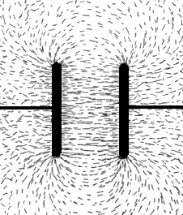
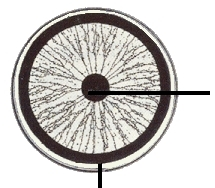
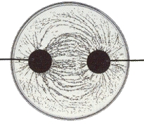
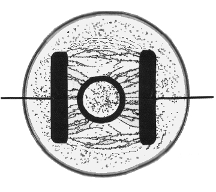

# Elektrische Felder

# Was Sind Elektrische Felder

Ein elektrisches Feld ist das physikalische Feld, das elektrisch geladene Teilchen umgibt und auf alle anderen geladenen Teilchen im Feld eine Kraft ausübt, die sie entweder anzieht oder abstößt. Es bezieht sich auch auf das physikalische Feld für ein System geladener Teilchen.

- Physikalisches Feld
- umgibt elektrisch geladene Teilchen
- wirkt auf andere geladene Teilchen im Feld
    - Teilchen mit gleicher Ladung werden abgestoßen
    - Teilchen mit unterschiedlicher Ladung werden angezogen

# Feldformen

homogenes Feld

radial-symmetrisches Feld

Feld zweier entgegengesetzt geladener Punktladungen

Abschirmung eines elektrischen Feldes

# Richtungsfeld (Fähnchen)

Die Fähnchen zeigen die Richtung des elektrischen Feldes an bestimmten Punkten an. Das Richtungsfeld gibt somit an, in welche Richtung eine positive Testladung bewegt werden würde, wenn sie sich an verschiedenen Punkten im Raum befindet.

# Ladungsmenge Q bei Veränderung der Spannung U

Je höher die Spannung, desto größer die Ladungsmenge.
$$ C = \frac{Q}{U} = Kapazität $$
Die Kapazität gibt an, wieviel Ladung auf einer Kondensatorplatte bei vorgegebener Spannung passt.
Einheit: $$ \frac{1C}{1V} = 1F (Farad) $$

Kondensator wird geladen → Elektroskop schlägt aus;
Abstand d der Kondensatorplatten wird vergrößert → Elektroskopausschlag wird größer.