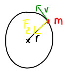

## Zentripetalkraft

Die Zentripetalkraft hält den Körper auf der Kreisbahn und wirkt zum Kreismittelpunkt:

Gleichung zum Berechnen der Zentripetalkraft:
$$ \frac{m \cdot v^2}{r} = F_z $$
$m$ ist die Masse des Körpers in Kg.
$v$ ist die Geschwindigkeit in m/s.
$r$ ist der Radius in m.
$F_z$ ist die Kraft in N (Newton).

## Geschwindigkeit auf der Kreisbahn

Um die Geschwindigkeit auf der Kreisbahn zu berechnen, teilt man den Umfang durch die Zeit für eine Umdrehung:
$$ v= \frac{2 \pi r}{T} $$
$r$ ist der Radius in m.
$T$ ist die Umlaufzeit in s.
$f = \frac{1}{T}$ ist die Frequenz.

## Gravitationskraft

$$ F_g = G \cdot \frac{M \cdot m}{r^2} $$
$M$ ist die Masse des Zentralkörpers in Kg.
$m$ ist die Masse des Satelliten in Kg.
$r$ ist der Radius in m.
$G$ ist die Gravitationskonstante ($G=6,67 \cdot 10^{-11}$)

Bei einer Kreisbewegung im All, kann man die Gravitationskraft mit der Zentripetalkraft gleichsetzen.

## Anhänge