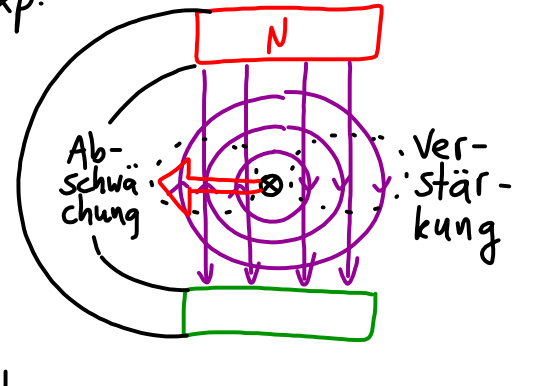
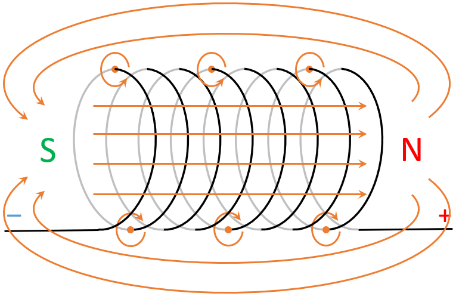

## Stromfluss

Fluss von Elektronen d.h. ein Elektronen-Strahl ist von einem Magnetfeld umgeben. Dieses wechselwirkt mit dem äußeren Magnetfeld, die Elektronen ändern ihre Bahn.

Durch den Stromfluss entsteht ein Magnetfeld, zum Beispiel durch eine stromdurchflossene Spule.

Ist das äußere Magnetfeld ein homogenes, so wird die Elektronen-Bahn zur Kreisbahn.

## Stromfluss

Die Elektronen fließen von Minus nach Plus (Linke-Hand-Regel, Physikalische Stromrichtung), der Strom fließt von Plus nach Minus (Rechte-Hand-Regel, Technische Stromrichtung).

