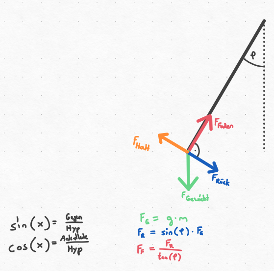

# Schwingungen (Federpendel, Fadenpendel)

## Themen

- Fadenpendel
- Federpendel
- Harmonische Schwingung (Sinus / Cosinus)
- Gedämpfte Schwingung (nur Erklären, nicht Rechnen)
- Resonanz (-frequenz) (nur Erklären, nicht Rechnen)
- Winkel im Dreieck berechnen / Auslenkwinkel berechnen

## Fadenpendel

### Faktoren Berechnen

Schwingungsdauer: *T* = 2*π**

Pendellänge: $l = (\frac{T}{2\pi})²*g$

*T* = *Schwingungsdauer*

*l* = *Pendellänge* [*m*]

*g* = *Erdbeschleunigung* *bzw*. *Ortsfaktor* (9, 81 *m*/*s*2)

### Kräfte Berechnen

*F*Gewichtskraft = *m* * *g*

*FRückstellkraft* = *sin*(*φ*) * *F*Gewichtskraft

$F_{\text{Fadenkraft}} = \frac{{F_{Rückstellkraft}}_{}}{tan(\varphi)}$

*g* = 9, 81

*m* = *Masse* [*Kg*]

*φ* = *Auslenkwinkel*

$F_{\text{Fadenkraft}} = \frac{m*g*sin(\varphi)}{tan(\varphi)}$

### Faktoren

- Pendellänge
- Ortsfaktor
- **Das Gewicht und die Auslenkung spielen bei der Schwingung keine Rolle!**

##

## Federpendel

### Faktoren Berechnen

Schwingungsdauer: 2*π**

Federhärte: $k = \frac{F_{G}}{s}$ bzw. $k = \frac{m*g}{s}$

*m* = *Masse* [*Kg*]

*k* = *Federhärte*

*s* = *Längenänderung* *der*  △ *l* *der* *Feder*, *durch* *Zugabe* *der* *Masse* *m*

### Kräfte Berechnen

*F*Gewichtskraft = *m* * *g*

### Faktoren

- Gewicht
- Federhärte
- Ortsfaktor
- **Auslenkung spielt bei der Schwingungsdauer keine Rolle!**

## Harmonische Schwingung Berechnen

Die Funktion zur harmonischen Schwingung beschreibt die Auslenkung eines Pendels im Verlauf der Zeit, wobei die Auslenkung im Ruhezustand 0 ist und zu einer Seite negativ wird. Wenn man beim Federpendel anstatt der Auslenkung die Höhe über dem Boden erhalten möchte, dann muss man die Amplitude durch zwei teilen und am Ende der Funktion, für die Verschiebung auf der Y-Achse, die Gesamthöhe des Pendels addieren.

Mithilfe der Ableitung lässt sich die Geschwindigkeit berechnen.

Mithilfe der zweiten Ableitung lässt sich die Beschleunigung berechnen.

### Struktur Und Berechnung Der Funktion

*y*(*t*) = *a* * *cos*(*ω* * *t*)

*y*′(*t*) =  − *a* * *sin*(*ω* * *t*)

*a* = *Amplitude* (*maximale* *Auslenkung* *bzw*. *maximale* *Länge*)

$\omega = \frac{2\pi}{T} = 2\pi*f = Kreisfrequenz$

*T* = *Schwingungsdauer*

$f = \frac{1}{T} = Anzahl\ Schwingungen\ pro\ Sekunde$

## Gedämpfte Schwingungen

Durch die Reibungskräfte nimmt die Amplitude der Schwingung mit der Zeit ab. Die Energie wird in Wärme umgewandelt. Man spricht von einer gedämpften Schwingung.

## Resonanz

Die Resonanz ist das Ergebnis, wenn man ein Objekt mit seiner natürlichen Schwingungsfrequenz, also seiner Resonanzfrequenz anregt.

## Winkel in Rechtwinkligen Dreieck Berechnen

RAD: Berechnung von Sin / Cos-Funktionen

DEG: Berechnung von Winkel

$\frac{a}{sin(\alpha)} = \frac{b}{sin(\beta)} = \frac{c}{sin(\gamma)}$

Zur Berechnung stellt man die Gleichung auf die fehlende Seite bzw. Winkel um.

$\alpha = co{s^{}}^{- 1}(\frac{a² - b² - c²}{- 2bc})$